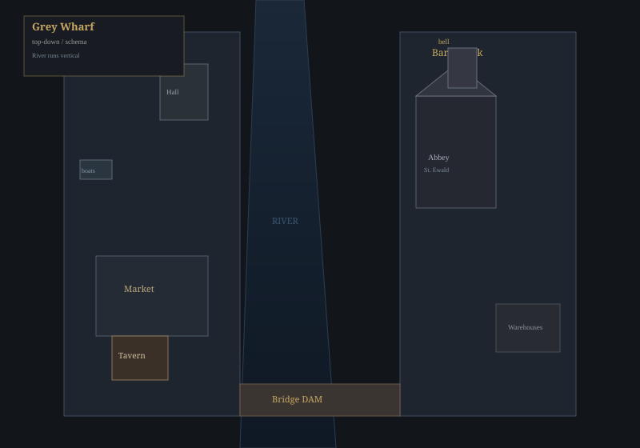
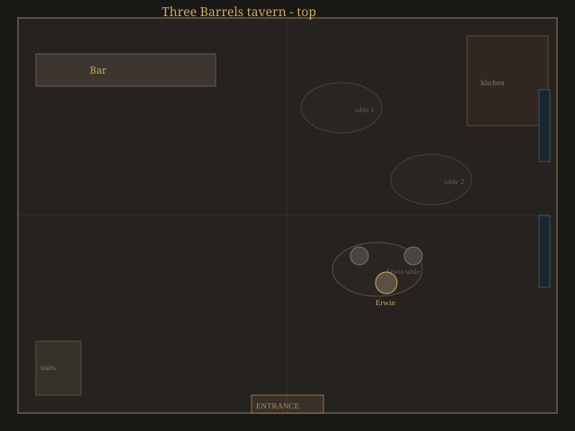
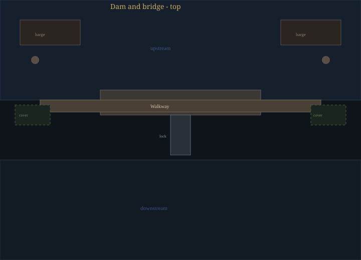
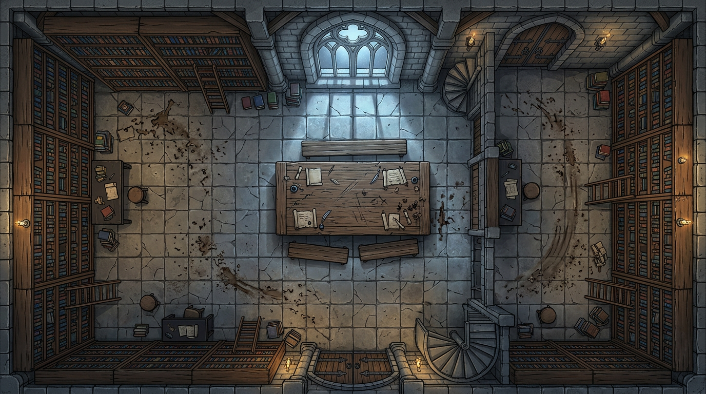
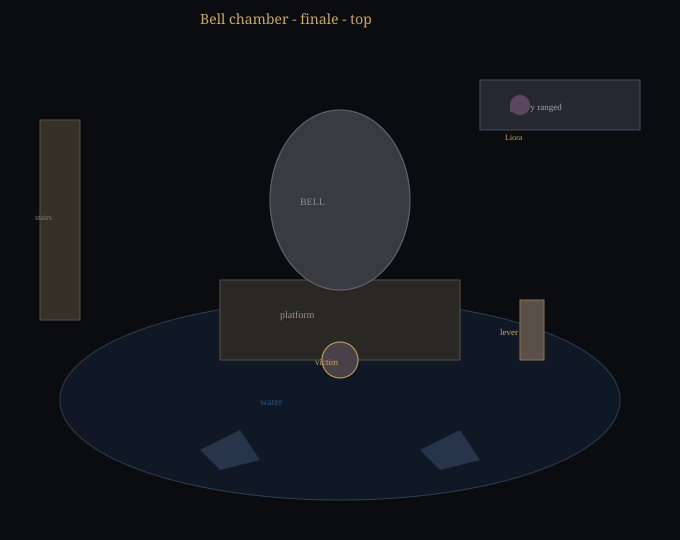
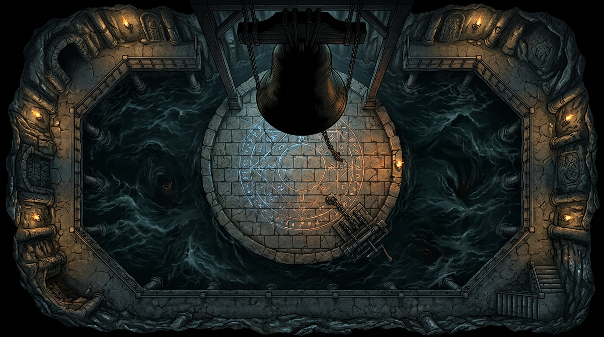

# Стартовое приключение: «Стеклянный звон» (вариант «Легенда десяти колец»)

*Две сессии по **3,5–4,5 часа**. Тот же каркас, что в `01-steklyannyy-zvon.md`, но сюжет и мотивы переложены с фильма **«Шан-Чи и легенда десяти колец»**: древняя организация, утрата любимого человека, **ложный голос за печатью** и цена открытия врат.*

*Город **Серый причал** у реки (можно заменить на **Торнвельд**).*

---

# Часть I. Что произошло на самом деле

*Прочитайте это **до игры**. Это **не** для игроков — полная хронология и мотивы, чтобы вы вели сцену уверенно.*

## Хронология правды

**Много лет назад.** У реки стоит обитель и колокол **«Стеклянный звон»**: в сплав добавлен **речной песок**, а в фундаменте шлюза — **камень с печатью**. По преданию **Та-Ло** (скрытая деревня за «мягкой гранью» воды) когда-то спрятала за запрудой не демона, а **затвор** от того, что **питается душами** — в текстах обители это названо сухо: **«то, что шепчет утонувшим имена»**.

**Пятнадцать лет назад.** В **стекольной мастерской** при обители пожар. Погибает **Ин** — жена **Сюй Вэня**, бывшего наёмника и нынешнего главы **Братства десяти колец** (десять тяжёлых железных колец — наследие, не магия MCU «как в кино», но **репутация бессмертия** и страх в городе). Ин погибла, **спасая** младенца сестёр — дым, обрушение. Церковь той поры **запретила** хоронить её **рядом с освящённой землёй** — «чужая кровь». Вэнь **ненавидит** духовенство.

**Десять лет назад.** Вэнь находит в **барахле** и у **связей в библиотеке** обители обрывки **трактата о печати**: колокол с речным песком **связан с руслом**; под запрудой, где лежит **утопленный** пригород, «спит **эхо** первого удара» — и **тонкий голос**, похожий на зов из-за грани. Вэнь **убеждён**, что **Ин** ждёт его **за печатью** (как Уэньву — что слышит зов **Ин** из Та-Ло). На самом деле **сущность за затвором** подстраивает **отголосок** памяти — **приманка**, как **Обитатель тьмы** подражал голосу в фильме.

**Пять лет.** Вэнь собирает **культ** под знаком **десяти колец** — бедняки, вдовы, те, кого река забрала. «**Пастыри стекла**» (название сохраняем для совместимости с картами и бестиарием) режут верёвки барж, возят **бочки** к шлюзу: **колотое стекло**, **соль**, **редкие соли** — чтобы **нарастить «семя»** в теле **живого молотка** и **согласовать** удар колокола с **резонансом** печати.

Параллельно он выстраивает **Братство десяти колец** как **сеть**: ночные **дозоры** у складов, **подставные** грузчики на причале, **связные** в трактирах, пары **наёмных** бойцов на каждом «узле» маршрута к шлюзу. Это **не** бесконечная армия, но **достаточно**, чтобы **задавить** малую группу следователей и **отрезать** путь к колоколу, если город **молчит**. Игрокам выгодно **разбудить** горожан — **ополчение**, **гильдия** грузчиков, **сёстры** с факелами — иначе финал превращается в **осаду** одних героев против **чужой** территории.

**Год назад.** Жрец **Клем** — долги перед **купцом Эрвиным**. Вэнь **шантажирует** его: доступ к колокольне и молчание, иначе долг **церкви**. Клем **соглашается** и думает, что речь о **ремонте колокола**. Он **не знал** о похищении.

**Три недели назад.** Вэнь и двое культистов **хватают** звонаря **Бейли** с лестницы колокольни. Ему вливают **настой** — он в бреду, но жив. Его тянут в **камеру** под колоколом и **вплетают** в кожу и сухожилия **стеклянную нить** (ритуал из трактата). Бейли — **не жрец**, но с **идеальным слухом** и **руками звонаря**: он станет **живым молотом**, который **одним ударом** вобьёт в колокол вибрацию, **ослабляющую печать** — «ключ», как **удар по вратам Та-Ло** в финале фильма.

**Сейчас.** Бейли **привязан** под колоколом; вода **бьёт** по ногам; стекло **ползёт** к металлу. Вэнь ждёт **третью ночь после полнолуния** — «**перелом воды**», когда шлюз даёт **резонанс**. Колокол наверху **звонит сам** — **мокрый** звук: внутри **конденсат** и **осколки** из трещин, которые дала связь с Бейли.

**Что под запрудой на самом деле.** Не демон и не «жена из Та-Ло». **Сгусток** голода и звука — **аберрация**: тысячи **микроскопических колокольчиков** из стекла и ила, **пульсирующих** в такт **сердцу** жертвы наверху. Если ритуал **завершить** — «эхо» **вырвется** в город как **волна отчаяния** (стресс, безумие) **или** река **вздёрнется** и **сломает** запруду — в зависимости от **вмешательства** героев. Вэнь **верит**, что услышит **Ин**. На деле услышит **шум тысячи утонувших** — и **сойдёт с ума** или **умрёт** в иллюзии воссоединения. **Бейли** в жёстком финале — **жертва**, не злодей.

**Опционально для углубления:** у Вэня есть **отчуждённый наследник** (аналог Шан-Чи) — **Сюй Кай**, годами скрывавшийся от отца. Если введёте его в сессию, он может **появиться** у запруды или в таверне: *«Я не вернулся за кольцами. Я вернулся **остановить** его.»*

---

## Братство против города (для ведущего)

**Идея:** у Вэня **большая группа поддержки** — она **мешает** партии на расследовании, **усиливает** засады и **закрывает** подходы к финалу. Чтобы **спасти город** и **людей** (и не утонуть в бою), герои **собирают свою** опору: **ополчение нижнего города**, **добровольцы** гильдии, **сёстры** и пономарь, **охрана** купцов — кто **поверил** и **пришёл** с факелами.

Ведите два **простых счётчика** (0–3 каждый). Их **не** обязано объявлять игрокам вслух — можно описывать последствия.

| Счётчик | Что отражает | Как растёт |
|--------|----------------|------------|
| **«Хвост братства»** | Насколько организация **в теме** о героях и **давит** | +1, если партия **громко** светилась (драка в таверне без прикрытия, допрос с стражей на виду, погоня с криками). +1, если **Эрвин** ушёл к Вэню **раньше**, чем герои добрались до запруды. Максимум **3**. |
| **«Союз города»** | Собранное **ополчение и доверие** | +1 за каждый **сильный** хук ниже (максимум **3**). Не обязаны взять все — но без **1+** финал заметно **жёстче** для мирных. |

**Крюки для «Союз города»** (игроки сами не знают про «+1», ведущий отмечает):

1. **Мирта и обитель** — сёстры дают **клятву** не поднимать оружие первыми, но **придут** с **факелами и тачками** блокировать **верхний** выход со шлюза, если герои **честно** сказали правду о печати и Бейли (**Дипломатия / Воля** по ситуации, или просто ролька без кубика).
2. **Фактор Торрен и купцы** — обещают **двадцать** с **дубьём** и **фонарями** у **нижних ворот** запруды, если партия **принесла** хоть **одну** железную улику (поддельная печать, записка Вэня) **до** полуночи второго дня.
3. **Причал** — **старейшины грузчиков** (через Гарна или отдельная сцена) соглашаются **не грузить** ночные бочки и **стянуть** людей к мосту в **ночь ритуала**, если герои **раскрыли** связь Эрвина и **не** убили громил в таверне без нужды (или **заплатили** обет на лечение раненых докеров).

**Сюй Кай** (если есть): даёт **+1** к «Союз города» **или** снимает **1** с «Хвост братства» — на выбор ведущего, когда он **публично** встаёт на сторону города.

**Как счётчики бьются в игре:**

- **«Хвост» 2–3:** в сцене 5 добавьте **+1 наёмника** или **ещё одного** стрелка; у запруды **патруль** братства **замечает** партию раньше (**Скрытность** на круг сложнее на **+1 к ЧЦ**).
- **«Союз» 1:** в сцене 8 **один** культист **отвлечён** — дерётся с **двумя** добровольцами в фоне (не трогайте их кубиками; просто **−1 враг** в волне 1).
- **«Союз» 2:** в сцене 8 союзники **держат галерею** — Вэнь **не может** в первый раунд **сдвинуться** к рычагу без **успешной** проверки **Ловкости / Рукопашной** (ЧЦ **12**) — его **оттесняют** копьями.
- **«Союз» 3:** в сцене 9 при вариантах **А** или **Б** **нижний город** получает **эвакуацию** или **затворы** вовремя: **половина** жертв наводнения **спасена** (опишите **людей на крышах**); при варианте **А** волна отчаяния **смягчена** — **−1 стресс** для партии или для **одного** ключевого NPC.

Если **«Союз» 0** и **«Хвост» 3** — финал **как у киношной осады**: герои **могут** победить, но **город** платит **полную** цену из таблицы исходов.

---

# Часть II. Перед первой сессией

- Откройте готовые **PNG** в `maps/` (как в оригинале) или сгенерируйте свои по описанию сцен.
- Прочитайте **Часть I** ещё раз и блок **«Братство против города»**.
- Решите: кто нанимает партию — **Мирта** (поиск Бейли) или **гильдия** (саботаж) — или **оба** заказа в одном брифинге.
- Заведите на листке **«Хвост братства»** и **«Союз города»** (оба 0 в начале).
- ЧЦ держите как **ориентиры**; подстраивайте под партию.

# Сессия 1. «Мокрый колокол»

**Баланс:** половина времени — **расследование**, половина — **экшен** (таверна + погоня/засада). По ходу сессии 1 дайте **крючки** к **«Союз города»** (см. **Братство против города**) — без союзников финал **жёстче**.

## Сцена 0. Брифинг у обители (крючок)

**Место:** дворик обители, поздний день, пахнет супом и речной сыростью.

**Сестра Мирта** — сухая женщина лет пятидесяти, руки в швах, голос ровный.

**Мирта:** «Добро пожаловать. Я не люблю нанимать мечи, но **полиция** смеётся: мол, звонарь **пьяница**, сам ушёл. А Бейли **трезвый**, как стекло. Третий день **нет** его. Комната в **бельэтаже** колокольни — **пусто**, постель **холодная**. Колокол… я слышала **две ночи**: будто внутри **кто-то хрипит**. Отец **Клем** запретил сёстрам подниматься наверх *без него*. Я хочу **человека** и **правды**. Платим **столько, сколько сочтёте справедливым** *(назовите сумму сами)*. Согласны?»

Если герои просят **людей** на ночь шлюза: **Мирта** не даст **мечи** без доказательств, но обещает: *«Если покажете, что там **не бог**, а **беда для города** — мы **выйдем**. Не воевать первыми. **Светить** и **держать** дорогу.»* (крюк к **«Союз города»**, см. выше.)

Если спросят про Клема:

**Мирта:** «Клем **нервничает** с прошлой недели. Молится **дольше** обычного. Я думала — к **Посту** готовится. Теперь не уверена.»

Если партия пришла по заказу **купцов** (саботаж), добавьте встречу с **фактором** на рынке:

**Фактор Торрен** *(резкий голос)*: «Верёвки на баржах **режут**. Если **шлюз** уйдёт — **нижний** город **вымоет**. Найдите, **кто**, и **остановите**. Платим **отдельно** от сестёр — или **вместе**, если договоритесь. Мне нужен **результат**, не слезы.»

---

## Сцена 1. Колокольня и комната звонаря

**Карта:** район обители — колокольня у храма.

**Лестница:** следы **чужой** обуви (не монашеской) — **Внимание / Анализ ЧЦ 10**.

**Перила:** соль, царапины стеклом — **Медицина / Природа ЧЦ 11** — «это не кровь; в постели — **стеклянная пыль**».

**Подушка:** записка при **Скрытность или Внимание ≥ 12**: *«Не звони на рассвете. Они слушают снизу. — Б.»*

**Отец Клем** может **встретить** их у подножия (он следил):

**Клем:** «Вы от сестёр? **Хорошо**. Наверху **опасно** — ветер срывает **кирпич**. Я пойду **с вами**. *пауза* …Бейли — **хороший** мальчик. Пусть **Господь** хранит его.»

Если спросят, **почему** запрет на колокольню:

**Клем:** «**Страх** — не грех. Там **ветер**… и **слухи**. Я **обязан** смотреть, чтобы **сёстры** не **падали**.»

Если **Проницательность ≥ 11** при взгляде на Клема — он **избегает глаз**, ладони **мокрые**.

**Если Клема ещё не ломали** (нет улик о бочках), он **держится** до таверны/запруды. Если игроки **давят** здесь (Запугивание ≥ 12 или прямое уличение):

**Клем:** «**Стойте**! Я… я **не хотел**… Мне сказали — только **ключ**! Что он **возьмёт кого-то** — я **не знал**! *всхлип* Это **Сюй Вэнь**! Он **жив** — в **шлюзе**! **Эрвин** всё возит! Я **проклят**…»

*(Если Клем сорвался рано — сократите детектив; если нет — он **молчит** до сцены с уликами.)*

---

## Сцена 2. Набережная и Гарн

**Гарн** сидит на ящике, чинит сеть, пахнет рыбой и водкой.

**Гарн:** «Бейли? А… **тихий** был. Не пил, как **другие**. Видел я **три ночи назад** — с **баржи** **сбросили** бочки. **Не вниз** по людям — **к запруде**. Звон **такой** — как **сыпется стекло** в воду. Мне **лет семьдесят**, я **не иду** к шлюзу ночью. **Тьма** там **есть**.»

Если дадут монету:

**Гарн:** «Ладно. **Эрвин** с теми бочками **знаком**. Всегда **ухмыляется**, когда **платят**. Иди к **«Трём бочкам»**.»

---

## Сцена 3. Ратуша / таможня

**Чиновник** зевает, бумаги пахнут сыростью.

**Чиновник:** «Бочки без печати? **Обитель, склад три**? Странно… печать **кривая**. Сама **посмотри**, если хочешь. Я **кофе** пойду.»

**Анализ или Обман ≥ 12** — печать **подделка** (узор креста **перевёрнут**).

Если игроки **задержат** чиновника вопросами:

**Чиновник:** «**Отстаньте**. Я **цифры** пишу, не **криминал**. Всё, что **мимо** меня — к **настоятельнице** несите.»

---

## Сцена 4. Таверна «У трёх бочек» — социалка и драка

**Карта:**

Если партия **до** разговора с Эрвином расспрашивает зал:

**Бармен:** «Эрвин? **Сидит** в углу, **как всегда**. **Кредит** мне **должен** — не **защищайте** его, если **что** пойдёт не так. **Кружки** — за **полцены**.»

**Эрвин** — полный, потный, за столом у **двух громил**. Увидев стражу или оружие — **поджимается**.

**Эрвин:** «Я **ничего** не… то есть **купец** я честный! Бочки? Какие бочки? *тихо* …Если это про **Вэня** — я **только возил**. Он **платит** хорошо. **Стекло**, соль… я **не спрашивал**! Он сказал — для **ремонта колокола**!»

**Громила 1** *(встаёт)*: «**Эрвин**, ты **слишком много** болтаешь.»

**Громила 2:** «**Уйдём** через заднюю. Или **заткнём** им рты.»

**Эрвин** *(визг)*: «**Нет-нет**! Я скажу! **График** у меня в **поясе**! **Третья ночь после полнолуния** — **перелом воды**! Он там будет! **На запруде**! *Его не трогайте* — он **безумен** — слышит **её голос**!»

**Развилка:**

- **Успешная Дипломатия** — Эрвин **вышел** в коридор, отдал **записку** без драки.
- **Провал** или **наглость** — громилы **бьют первыми** — **бой** (толпа даёт **+1 укрытие** за столом).

**Бармен** *(в драке)*: «Не **ломайте** столы! **Стражу**! Кто **платит** за **кровь**?!»

После боя или уговоров **Эрвин** (если жив и на свободе):

**Эрвин:** «Берите **записку**! Я… я в **Морхейм**! *бежит*»

*(Записка: «III ночь после луны — вода ломается. К. ждёт молот. — В.»)*

---

## Сцена 5. Погоня или засада у запруды

**Карта:**

Если за Эрвином **погоня** — он **бежит к мосту**, зовёт **людей Вэня** (носители **колец** на руках — визуальный якорь к фильму).

**Засада:** три **Наёмника** + один **Стрелок** (см. бестиарий). Стрелок на **высоте** (условно **Даль** к настилу). Если **«Хвост братства» ≥ 2** — добавьте **+1 наёмника** или **второго стрелка**; если **3** — и то, и другое *(или одну **волну** подкрепления через **2 раунда**)*.

**Наёмник:** «**Лишние** уши — в **реку**!»

**Стрелок:** *(не кричит — только стреляет)*

После победы или ухода — **гудит колокол** сам по себе — **река отступает** на секунду — на илистом дне **видна** огромная **рука** из **стекла** и ила *(или силуэт — по вкусу ужаса)*.

**Клиффхэнгер** — далёкий крик **Бейли** *(если хотите)*: *«**Он**… не отпускай… **удар**…»*

---

# Сессия 2. «Перелом воды»

## Сцена 6. Библиотека обители

**Карта:**

**Мирта** *(шёпотом)*: «Трактат… я **не знала**, что он **хранится** открыто. **«Песок реки в колоколе слышит дно»**… Боже. Тут же — про **печать** и про **голос**, что **не Божий**…»

Если **История / Магические знания ≥ 11** — герои понимают связь **русла**, **ритуала** и риск **разрыва затвора** (аналог открытия врат без армии Та-Ло).

---

## Сцена 7. Клем в каморке / под арестом

*(Если Клем уже всё сказал — замените на **письмо** от него.)*

**Клем:** «Я **отдам** ключ… от **люка** в колокольне. Он ведёт **вниз**, к **шлюзу**. Вэнь **сказал** — Бейли **добровольно**… но я **слышал крики**. *плачет* Я **не священник** — я **трус**. Убейте меня или **спасите его** — но **не дайте** ему **ударить** в колокол… или **город**… я **не знаю**, что хуже…»

---

## Сцена 8. Спуск и бой

**Волна 1:** два **Культиста** + один **Ножник** (бестиарий). Учтите **«Союз города»** из блока выше: при **1+** один культист **занят** добровольцами; при **2** Вэнь **задержан** на первый раунд (см. таблицу **Братство против города**).

**Культист 1:** «**Вода** помнит.»

**Культист 2:** «**Кольца** зовут.»

**Волна 2:** каждые **2 раунда** у решётки — **+1 стресс** (вода поднимается). Если **«Союз» 0**, добавьте **ещё одного** культиста с **нижней** лестницы — братство **держало** резерв.

**Сюй Вэнь** с **галереи** *(кричит)*: «**Не подходите**! **Один удар** — и **она** ответит! Я **слышал** её! Это **не ловушка** — это **Ин**!»

**Вэнь** *(когда ранен)*: «Вы **не знаете**… что значит **потерять** ту, ради кого **жил** тысячу сражений… *всхлип* Я **услышу** её…»

---

## Сцена 9. Финал — камера под колоколом

**Антураж:**

**Баттлмап для боя:**

**Бейли** *(искажённый шёпот, вода глушит)*: «**Режь**… **режь** меня… не **дай**… **ударить**…»

**Вэнь** *(если жив, у рычага)*: «**Смотрите**! Стекло **принимает** его! Он **станет** **молотом**! **Один** удар — и **печать** **отзовётся** **мягко**! Или **ломайте** — и **река** **сорвёт** **плотину**! **Выбирайте**! Я **уже** **не могу** **остановиться** — **она зовёт**!»

**Вэнь** *(если его убили, последние слова)*: «Ин… я **шёл** к тебе…»

### Таблица исходов (ведущий зачитывает последствия честно)

| Вариант | Что происходит |
|---------|----------------|
| **А.** Ритуал **завершён** (удар в колокол по замыслу Вэня) | Бейли **поглощён**; город переживает **волну отчаяния** или **странное облегчение** (снимите **1 стресс** «невинным» NPC); **голос** в колоколе **слышен** по ночам — чужой, **сладкий**, **ложный**. При **«Союз города» 3** смягчите масштаб (**−1 стресс** партии или ключевого NPC), см. **Братство против города**. |
| **Б.** **Ломают** механизм / **перерезают** верёвки запруды | **Наводнение** нижнего города; **Бейли** вытащен, но **калёка** (без рук или без слуха). При **«Союз» 3** **половина** жителей нижнего уровня **успешно** эвакуирована (факелы, верёвки, крыши). |
| **В.** **Убивают** Вэня у рычага | Ритуал **рвётся**; Бейли **умирает** от шока и стекла в теле; **город** цел. Вэнь: *«Ин… я **шёл**…»* |
| **Д.** **Жертва** героя (по согласию) | **Воля ≥ 12** или **3 стресса**; исход согласуйте — **редко** без цены. |

Идеального «все спасены» **нет**.

**Эпилог — Мирта** *(одна фраза)*: «Колокол теперь… **помнит**. И **лжёт** тем, кто **хочет** услышать **своё**.»

---

# Бестиарий приключения

*ЧЦ защиты = 8 + Ловкость + доспех. Урон = (итог атаки − ЧЦ) + бонус.*

## Наёмник Эрвина

- **Угроза:** низкая  
- **Тело 3, Ловкость 2, Разум 1, Воля 1**  
- **Раны 6** · кожа +1 к ЧЦ  
- **Дубина +1**  
- **Реплика:** «Деньги **платят** — мы **бьём**.»

## Стрелок на засаде

- **Угроза:** низкая  
- **Тело 2, Ловкость 3, Разум 1, Воля 2**  
- **Раны 5**  
- **Лук +2**, предпочитает **Даль**  
- **Особое:** **укрытие +1** на карте запруды.

## Культист «Пастыря» / носитель кольца

- **Угроза:** средняя  
- **Тело 3, Ловкость 2, Разум 2, Воля 4**  
- **Раны 8**  
- **Короткий меч +1**  
- **Особое:** перед смертью **1 стресс** ближайшему в **Рукопашной** (крик).

## Ножник культа

- **Угроза:** средняя  
- **Тело 2, Ловкость 4, Разум 1, Воля 2**  
- **Раны 7**  
- **Кинжал +1**  
- **Особое:** **первая** атака в сцене **+1** к итогу (внезапность).

## Сюй Вэнь, владыка Десяти колец

*(Замена **Лиоры, «Пастырь стекла»** в этом варианте.)*

- **Угроза:** высокая  
- **Тело 2, Ловкость 3, Разум 4, Воля 5**  
- **Раны 9**  
- **Дальняя магия «Осколки» +2**, **кинжал +1** в рукопашной *(кольца — атрибутика; механика как у Лиоры)*  
- **Цель в бою:** дойти до **рычага** (1 ОД на **Сдвиг** к зоне рычага).  
- **Реплики:** см. сцену 8–9.

---

## Подсказки по системе

- Проверки — **2d6 + атрибут + ранг**; ЧЦ как ориентир.  
- Бой — **Рукопашная / Рядом / Даль**.  
- Магия Вэня — **дальняя атака** по правилам главы 4.

---

*Оригинал без отсылок к фильму: `01-steklyannyy-zvon.md`.*
