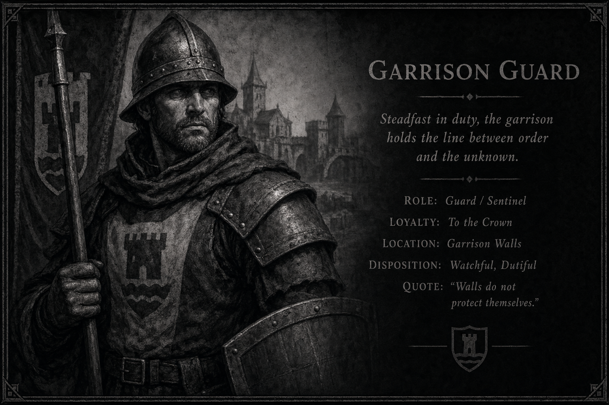
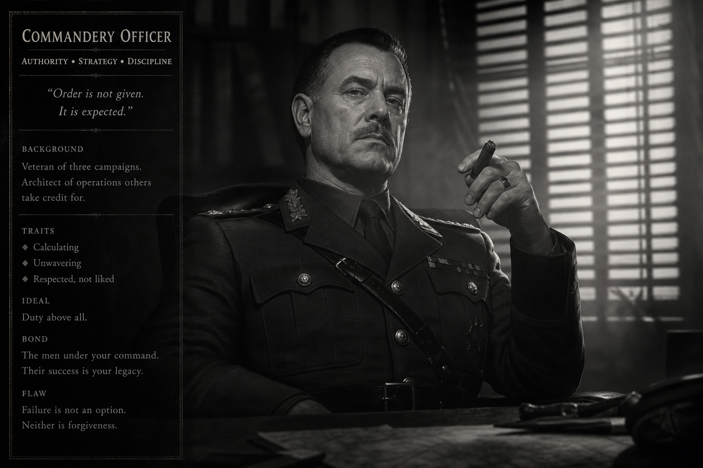
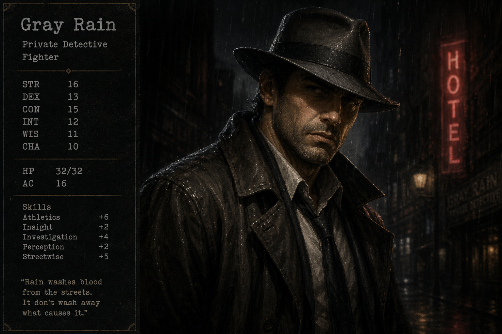
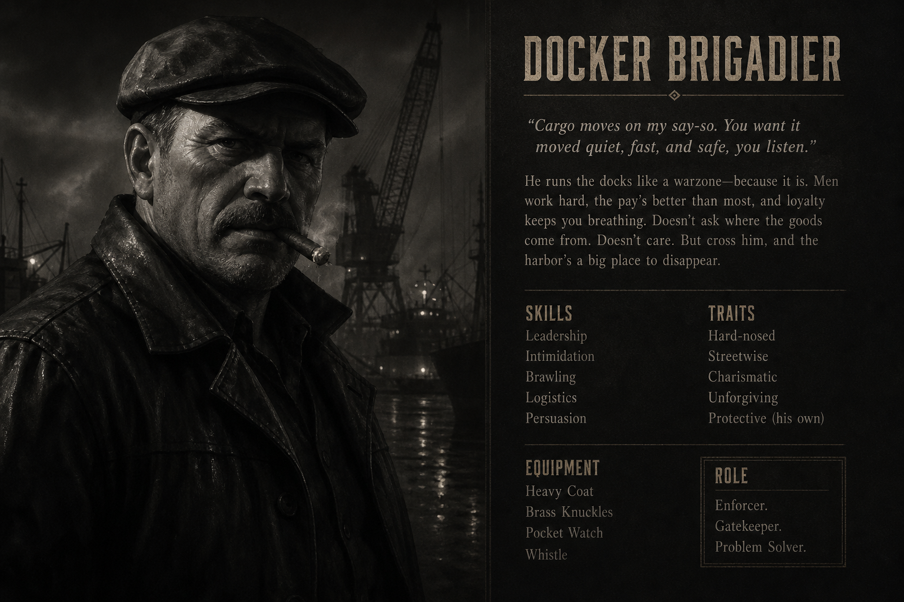
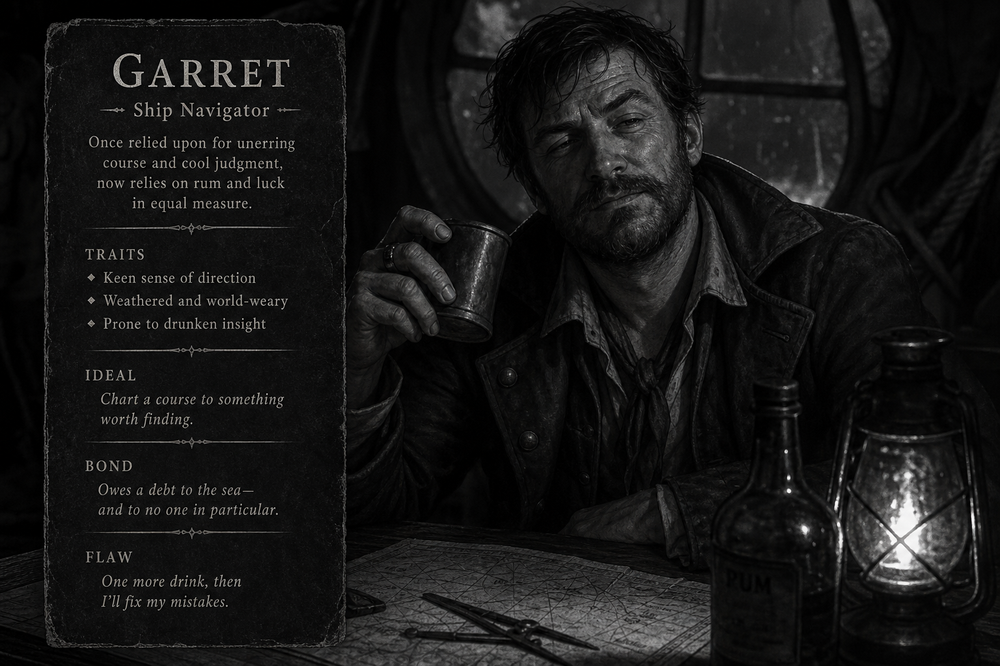
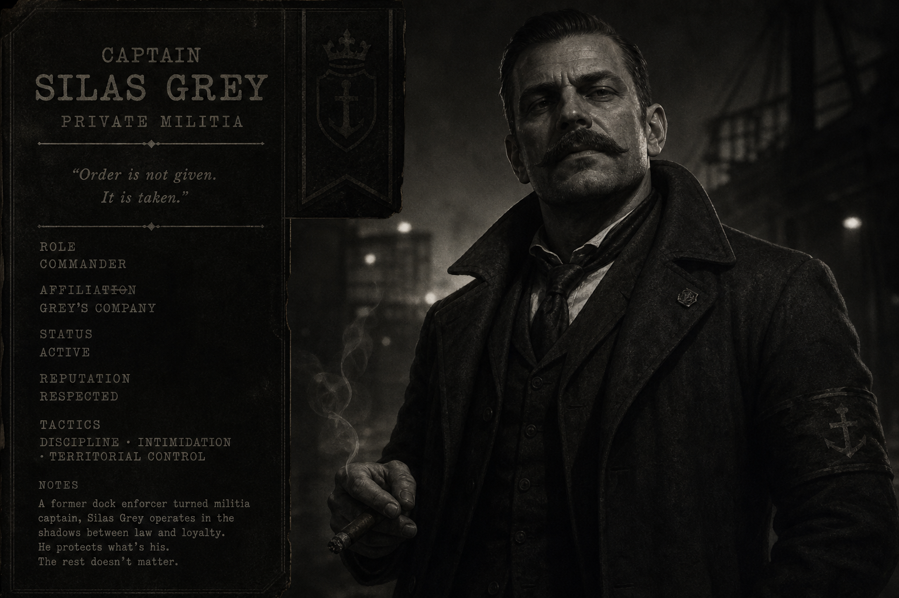
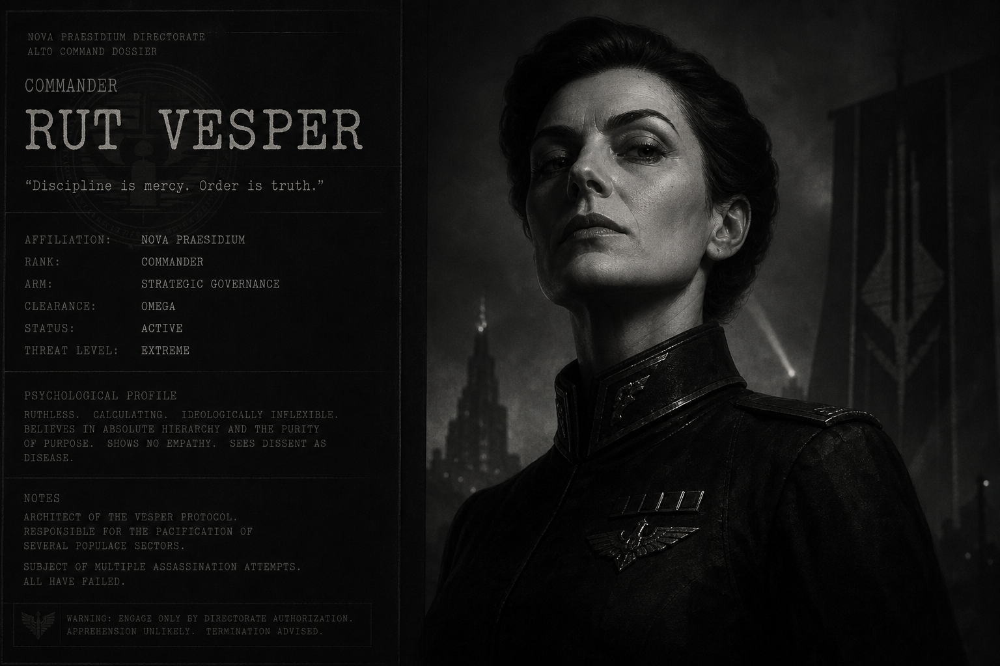

# Большое нуарное дело: «Чёрный счёт»

*Нуарное детективное приключение для «Корней судьбы». Полная версия для ведущего: **~68 страниц** текста и таблиц + **46** слотов под иллюстрации (см. часть IX).*

- **Длительность:** **8 сессий** по 3–4 часа (или 4–5 длинных вечеров).
- **Жанр:** нуар, коррупция, интриги, грязные сделки, моральные компромиссы.
- **Место:** портовый город на реке и в заливе — **Серый Причал** (или любой ваш).
- **Рекомендуемые модули:** `core`, `tactical_combat`, `equipment`, `bestiary`, `states` (по вкусу `wounds`, `crits_and_fumbles`, `squads`).
- **Опциональный кастомный модуль:** [«Нуарное расследование»](../modules/noir-investigation.html) — процедуры улик, Жары и Ресурса.

---

# Часть I. Что произошло на самом деле (для Хранителя)

*Прочитайте это до игры. Это не для игроков.*

## 1) Правда в одном абзаце

Городом правит не закон, а **долги**. Власть (ратуша и гарнизон), деньги (портовые дома), страх (частные “охранные” конторы) и благочестие (официальная церковь) связаны тайной бухгалтерией — **“Чёрным счётом”**. В нём отмечают не только взятки, но и судьбы: чей сын уйдёт на корабль и не вернётся, чей дом сгорит “случайно”, чья жена пропадёт “по пьянке”. Неделю назад исчез главный счётный, который вёл книгу: он решил продать её наружу — и был убит. Книга исчезла вместе с ним. Теперь все, кто подписывал “чёрные” сделки, охотятся за **книгой**, пытаясь уничтожить компромат или, наоборот, выторговать власть. Партия оказывается между фракциями и шестью сыщиками, которые ведут собственные игры.

## 2) Что на самом деле ищут все

**“Книга Чёрного счёта”** — это три вещи сразу:

1) **Реестр платежей**: суммы, даты, подписи посредников.
2) **Реестр услуг**: “два человека на мосту”, “ночная проверка склада”, “письмо в столицу” и т.п.
3) **Реестр залогов**: кто на кого держит компромат, какие семьи и кого “закладывали”.

*Важно:* в книге есть “ключ”: на последних листах спрятан список **настоящих владельцев** двух важнейших активов — **плавучего арсенала** и **Клуба “Эбонит”**. Это не имена, а система **условных знаков**, понятная только тому, кто видел “коды” в трёх местах города.

## 3) Убийство и исчезновение

**Жертва:** Салом Рейн, городской счётный при Портовой палате.  
**Официально:** “упал в реку” после пьянки.  
**На деле:** его задушили мокрой верёвкой в номере отеля, затем унесли по служебным коридорам, а тело бросили у старой лестницы на набережной.

**Книга исчезла** не из кабинета. Рейн вынес её заранее, оставив “пустышку”, и спрятал там, где:

- нельзя искать официально,
- слишком опасно искать неофициально,
- и где он думал “переждать ночь”.

Он выбрал **военный корабль** — потому что у него была знакомая на борту и потому что корабль в ту ночь стоял у дальнего пирса, вне городских слухов.

## 4) Настоящий заказчик (и настоящая ставка)

Главный выгодополучатель схемы — **Командор Рут Веспер**, начальник гарнизона и “временный” управляющий портом. Он строит карьеру на показательной чистке, но сам держит город на коротком поводке через “Чёрный счёт”.

Командор не просто хочет уничтожить книгу. Он хочет, чтобы книга **всплыла публично** — но в “исправленной” версии, где виноваты будут:

- один удобный купец,
- один “сумасшедший” проповедник,
- и одна банда докеров.

Партия может доказать обратное — но тогда цена будет не “деньги”, а **жизнь** и **репутация**.

## 5) Как всё закончится, если герои не вмешаются

- Веспер устроит “рейд” по трущобам, повесив всё на докеров и контрабандистов.
- Портовая палата сменит владельцев, “Эбонит” перейдёт под военную охрану.
- Сыщики перегрызутся, двое погибнут “случайно”.
- Город будет “очищен”, но станет **военным лагерем**.

## 6) Хронология правды

**Двадцать лет назад.** Порт **Серый Причал** переживает “великую перестройку”: гарнизон получает право **контролировать пирсы**, палата — право **писать реестры**, церковь — право **закрывать глаза** на бедняков. Командор **Веспер** (тогда капитан) и председательница **Кроу** (тогда юрист) вместе придумывают **единую книгу долгов** — не для казны, а для власти.

**Двенадцать лет назад.** Клуб **«Эбонит»** становится “ночной палатой”: там подписывают сделки, которые нельзя вынести на свет. **Мадлен Эбон** получает долю от каждого платежа, записанного в книге.

**Восемь лет назад.** **Оскар Нолл** покупает половину барж и начинает финансировать **Патруль Серого Дождя** — частную охрану, которая делает то, что стыдно гарнизону.

**Пять лет назад.** **Салом Рейн** назначают главным счётным. Он честен, но не наивен: ведёт книгу **как оружие**, копируя страницы по ночам. В книге появляется **тройной код** владельцев — без него имена не читаются.

**Год назад.** Рейн влюбляется в **Кормчую Эйр** с корабля «Северная Вдова». Она не знает про книгу, но знает, что гарнизон **врёт** в журналах проходов.

**Три месяца назад.** Рейн находит в реестре залогов **имя сироты** из приюта «Белая Крапива» — ребёнка, которого “заложили” за долг отца-докера. Он впервые решает **продать книгу** наружу.

**Две недели назад.** Рейн встречается с **Адель Ним (“Перо”)** в доме «Сломанный Фонарь». Она обещает публикацию. **Иона Вельт** предлагает купить книгу целиком. **Маркус Флинт** подслушивает.

**Неделю назад (ночь убийства).** Рейн берёт **настоящую** книгу и **пустышку** (пустой переплёт с парой поддельных листов). Он идёт в отель «Золотой Лист», где его ждут люди **Серого Дождя** по заказу **Веспера**. Его душат **мокрой верёвкой** (заказ из канатной мастерской, соль — чтобы не пахло кровью). Тело выносят служебным коридором к **Серой лестнице**. Книгу Рейн успел передать **штурману** на «Северной Вдове» — **Гаррету Холму**, который прячет её в тайнике палубы.

**Сейчас.** Официально: “утопленник”. Неофициально: охота. Шесть сыщиков, восемь фракций, одна книга. Партия — последняя переменная, которую никто не закладывал в счёт.

---

# Часть II. Перед первой сессией (для Хранителя)

## 1) Тон и договор

Это дело про:

- **выбор меньшего зла**;
- людей, которые делают плохие вещи из “правильных” причин;
- победы, которые оставляют грязь на руках.

*Если стол не любит тяжёлый нуар:* снизьте цену, оставив угрозы более личными, а не системными.

## 2) Карта дела (сеть улик)

```
Серая лестница ──► Морг ──► Отель ──► Прачечная ──► Верфь ──► Пирс №7 ──► «Северная Вдова»
       │              │         │                                      │
       └─► Ратуша ──► Код печати (Палата / Нолл)                       │
       └─► Канатная ──► Код верёвки                                     │
       └─► Эбонит ──► Код ночи ─────────────────────────────────────────┘
                              │
                    Книга + три кода ──► Арсенал / Финал у мыса
```

**Три кода** (нужны, чтобы прочитать владельцев в конце книги):

| Код | Где | Знак | Значение в книге |
|-----|-----|------|------------------|
| **Верёвки** | Канатная мастерская | **Двойной узел «петля в петле»** | Первая буква условного имени |
| **Печати** | Палата или особняк Нолла | **Перевёрнутый якорь** | Вторая буква |
| **Ночи** | Клуб «Эбонит» | **Три точки туши** | Третья буква |

Без кодов книга всё равно полезна (взятки, залоги), но **главная тайна** останется зашифрованной.

## 3) Счётчики (если модуль `noir_investigation` включён)

- **Жара** стартует с **1**.
- **Ресурс** стартует с **2**.
- После сцен **6, 12, 18, 24, 30** — **Тест на вывод**.

Без модуля ведите то же нарративно: провал = осложнение, не “ничего не нашли”.

## 4) План сессий

| Сессия | Название | Локации | Баланс |
|--------|----------|---------|--------|
| **1** | «Труп без воды» | Серая лестница, морг, ратуша, аптека | расследование |
| **2** | «Золотой Лист» | отель, прачечная, канатная, таверна | расследование + экшен |
| **3** | «Три кода» | Эбонит, рынок, обитель, ресторан «Маяк» | социалка + улики |
| **4** | «Сыщики» | особняк Нолл, склад, приют, «Сломанный Фонарь» | интриги |
| **5** | «Пирс №7» | комендатура, казармы, пирс, верфь | погоня + засада |
| **6** | «Северная Вдова» | военный корабль | лабиринт + бой |
| **7** | «Арсенал» | плавучий арсенал, катакомбы | сделка крови |
| **8** | «Книга на стол» | дом у мыса | финал и эпилог |

ЧЦ — **ориентиры**; подстраивайте под партию. Карты сцен — в `maps/chernyy-schet/` (см. ссылки в части V). Общую карту города можно взять из `maps/01-gorod-seryy-prichal.png`.

## 5) Таблица улик (шпаргалка)

| Улика | Где | Куда ведёт |
|-------|-----|------------|
| Следы волочения к служебной двери | Серая лестница | Отель |
| В лёгких нет воды | Морг | Убийство, не утопление |
| Приказ о пирсе №7 | Ратуша | Пирс, корабль |
| Снотворное с поддельной подписью | Аптека | Отель, Эбонит |
| Мокрая верёвка с солью | Отель | Канатная |
| Квитанция прачечной | Отель/прачечная | Верфь |
| Двойной узел (код) | Канатная | Расшифровка книги |
| Перевёрнутый якорь (код) | Палата/Нолл | Расшифровка книги |
| Три точки туши (код) | Эбонит | Расшифровка книги |
| Пуговица морской формы | Серая лестница | Корабль |
| «Книга у штурмана» | Казармы/таверна | «Северная Вдова» |
| Тайник на палубе | Корабль | Книга |
| Мёртвая фирма арсенала | Арсенал | Веспер / Нолл |
| Следы борьбы | «Сломанный Фонарь» | Сыщики, Перо |

---

# Часть III. Действующие лица

## 1) 8 фракций (к которым можно примкнуть или предать)

Каждая фракция предлагает **пользу**, требует **цены**, и мстит за **предательство**.

### 1. Портовая палата “Счёт и якорь”

- **Лицо:** председательница **Эльза Кроу** (улыбка как печать, голос как бумага).
- **Сила:** документы, влияние, доступ к складам и реестрам.
- **Цена:** “не шуметь”, не трогать “уважаемых людей”.
- **Предательство:** делает из вас “воров”, блокирует работу, закрывает двери.

### 2. Гарнизон и комендатура

- **Лицо:** командор **Рут Веспер** (идеальная форма, глаза усталые, руки чистые).
- **Сила:** аресты, оружие, корабли, “закрытые зоны”.
- **Цена:** подчинение, служба “во благо”.
- **Предательство:** объявят охоту; Жара растёт быстрее.

### 3. Клуб “Эбонит”

- **Лицо:** хозяйка **Мадлен Эбон** (парфюм, холодный смех, глаза как стакан).
- **Сила:** шантаж, слухи, “ночные сделки”.
- **Цена:** услуга за услугу; всегда есть скрытая строка.
- **Предательство:** сливает информацию вашим врагам, ломает репутацию.

### 4. Дом Солёного Стекла (портовые богачи)

- **Лицо:** патриарх **Оскар Нолл** (сигара, кашель, два телохранителя).
- **Сила:** деньги, баржи, частные охранники.
- **Цена:** вы “инструмент”.
- **Предательство:** вас выкупят — чтобы потом сломать.

### 5. Докерский союз “Синяя верёвка”

- **Лицо:** бригадир **Томас Рив** (руки в мозолях, честь без иллюзий).
- **Сила:** люди, маршруты, “видели всё”.
- **Цена:** справедливость — иногда кулаком.
- **Предательство:** порт станет для вас слепым.

### 6. Церковь Св. Эвальда (официальная)

- **Лицо:** настоятель **отец Клеман** (не тот, что в старте; имя можно сменить), мягкая улыбка, жёсткие договоры.
- **Сила:** моральное давление, убежище, доступ к “исповедям”.
- **Цена:** “не трогать святое”, закрывать глаза на удобное.
- **Предательство:** публичное проклятие и социальная изоляция.

### 7. “Патруль Серого Дождя” (частная охрана)

- **Лицо:** капитан **Сайлас Грей** (пальто, мокрая шляпа, чеканная речь).
- **Сила:** насилие без формы, слежка, устранения “в тёмном”.
- **Цена:** вы становитесь частью грязи.
- **Предательство:** вас “не станет” ночью.

### 8. Контрабандисты “Чёрные Ласточки”

- **Лицо:** шкиперша **Лара “Ласточка” Вейн** (шрамы, улыбка, быстрые решения).
- **Сила:** тайные пути, кораблики, поддельные печати.
- **Цена:** риск и доля.
- **Предательство:** вас сдадут не врагам — а “рынку”.

---

## 2) 6 сыщиков: каждый ведёт свою игру

Это не NPC-помощники по умолчанию. Это конкуренты, союзники и ловушки.

### Сыщик 1. “Пепел” Маркус Флинт

- **Роль:** бывший стражник, ныне частник.  
- **Цель:** вытащить из книги имя человека, который уничтожил его семью.  
- **Особое:** знает улицы; всегда приходит первым на место “случайной” драки.

### Сыщик 2. Адель Ним, “Перо”

- **Роль:** журналистка и архивистка.  
- **Цель:** опубликовать книгу — и пережить ночь после публикации.  
- **Особое:** может дать улики, но почти всегда повышает Жару.

### Сыщик 3. Лейтон Варр

- **Роль:** юрист Портовой палаты.  
- **Цель:** вернуть книгу председательнице, сохранив её власть.  
- **Особое:** “закон” — инструмент, не щит.

### Сыщик 4. Сестра Мирта Севен (монастырская)

- **Роль:** “тихая” монашка с сетью исповедей.  
- **Цель:** спасти сирот и вдов, которых “заложили” в счёте.  
- **Особое:** даёт убежище, но требует моральной цены.

### Сыщик 5. Кормчий Келл Эйр (моряк)

- **Роль:** человек с военного корабля, который не верит гарнизону.  
- **Цель:** очистить имя экипажа и не дать книге утонуть вместе с людьми.  
- **Особое:** путь на корабль открывает раньше, чем “официально”.

### Сыщик 6. “Профессор” Иона Вельт

- **Роль:** криминалист-алхимик (или просто аналитик, если без фэнтези).  
- **Цель:** купить книгу и исчезнуть из города.  
- **Особое:** у него есть метод “прочитать” подделку, но он продаёт метод отдельно.

### Когда сыщики вмешиваются

| Сыщик | Первая сцена | Если союзники | Если враги |
|-------|--------------|---------------|------------|
| Флинт | 5 | Канатная, корабль | Крадёт улику в 19 |
| Перо | 16 | Публикация в финале | Подставляет партию (+Жара) |
| Варр | 9 | Палата, код печати | Арест по форме |
| Мирта | 13 | Убежище, −Жара | Молчит о сиротах |
| Келл | 25 | Тайник на корабле | Предупреждает гарнизон |
| Вельт | 18 | Экспертиза книги | Подделка улик |

---

# Часть IV. 23 локации (грязь, коррупция, сделки)

*Каждая локация — узел. Ведите их как сеть: в каждой есть 1–2 улики, 1 опасность, 1 сделка.*

## Район 1: “Свет витрин”

### Локация 1. Отель «Золотой Лист»

- **Образ:** ковры, как болото; музыка, как ложь.  
- **Что здесь:** номер, где убили Рейна (официально “сдан”).  
- **Улики:** мокрая верёвка с солью; квитанция прачечной с клеймом корабельной мастерской.  
- **Сделка:** управляющий продаст ключ от служебного коридора за Ресурс/услугу.  

### Локация 2. Ресторан «Маяк»

- **Образ:** окна на воду, столы на кости.  
- **Что здесь:** встречаются палата и охрана.  
- **Улики:** разговор “про пустышку”; намёк на “кодовые метки”.  
- **Опасность:** вас “узнают” люди Патруля Серого Дождя.

### Локация 3. Площадь Ратуши

- **Образ:** камень чистый, воздух грязный.  
- **Что здесь:** доска приказов; слухи; стража.  
- **Улики:** приказ о ночном перекрытии пирса №7 (накануне убийства).  
- **Сделка:** чиновник “потеряет” бумагу, если вы принесёте ему компромат на коллегу.

### Локация 4. Клуб «Эбонит»

- **Образ:** бархат, дым, чужие тайны.  
- **Что здесь:** чёрная почта и сделки.  
- **Улики:** список гостей ночи убийства (не полный); знак-код на карточке Рейна.  
- **Сделка:** Мадлен даст имя, если вы принесёте “не её” письмо из особняка Нолла.

### Локация 5. Особняк Нолла (“Дом Солёного Стекла”)

- **Образ:** роскошь, как плесень.  
- **Что здесь:** портовые деньги и “чистая” благотворительность.  
- **Улики:** печать на сейфе совпадает с отметкой в книге; счёт за охрану Серого Дождя.  
- **Опасность:** дуэль словами; провал делает вас “вором” для всего города.

## Район 2: “Дно и верёвки”

### Локация 6. Докерский склад №3

- **Образ:** смола, мокрое дерево, брань.  
- **Улики:** пустые ящики с военными маркировками; “пятая” подпись в реестре.  
- **Опасность:** отряд докеров, если вы пришли с гарнизоном.

### Локация 7. Таверна «У трёх бочек» (если используете старую карту)

- **Образ:** дешёвый ром и дорогая информация.  
- **Улики:** разговор о “книге на воде”; имя “Келл”.  
- **Сделка:** бармен скрывает сироту Рейна; за неё будут торговаться.

### Локация 8. Канатная мастерская

- **Образ:** верёвки, как петли.  
- **Улики:** заказ “мокрой верёвки” на отель; “двойной узел” — код.  
- **Опасность:** мастер боится охраны; провал = +1 Жара.

### Локация 9. Набережная “Серая лестница”

- **Образ:** вода лижет камень, как алиби.  
- **Что здесь:** “нашли тело”.  
- **Улики:** следы волочения к служебной двери; пуговица морской формы.  

### Локация 10. Рыбный рынок

- **Образ:** кровь на льду.  
- **Улики:** контрабандный шифр “Ласточек”; слух о “книге на борту”.  
- **Сделка:** Ласточки дают проход, если вы “закроете” одного стражника.

## Район 3: “Святость и нож”

### Локация 11. Обитель Св. Эвальда

- **Образ:** свечи и тень.  
- **Улики:** исповедь: Рейн боялся “командора”; список сирот-залогов.  
- **Сделка:** Мирта просит спасти двух людей, иначе она не помогает.

### Локация 12. Приют “Белая Крапива”

- **Образ:** детский смех как преступление.  
- **Улики:** ребёнок видел, как Рейн передавал свёрток женщине в форме.  
- **Опасность:** сюда придут “проверяющие”.

### Локация 13. Морг при больнице

- **Образ:** чистые столы, грязные причины.  
- **Улики:** на шее след от верёвки; в лёгких нет воды (не утонул).  
- **Сделка:** врач даст заключение, если вы доставите ему редкое лекарство.

### Локация 14. Аптека “Сухая соль”

- **Образ:** стекло, этикетки, яд.  
- **Улики:** рецепт на снотворное для Рейна (подпись подделана).  

## Район 4: “Город под формой”

### Локация 15. Комендатура

- **Образ:** порядок как дубинка.  
- **Улики:** журнал проходов к пирсу №7; приказ Веспера “в устной форме”.  
- **Опасность:** вас могут закрыть “на ночь”.

### Локация 16. Казармы

- **Образ:** пот и дисциплина.  
- **Улики:** солдат слышал про “книгу у штурмана”; списки “переводов”.  
- **Сделка:** один капрал поможет, если вы вытащите его брата из долгов.

### Локация 17. Пирс №7 (дальний)

- **Образ:** туман как занавес.  
- **Улики:** следы ночной лодки; клеймо корабельной верфи.  
- **Опасность:** засада Серого Дождя.

### Локация 18. Верфь

- **Образ:** железо, как совесть.  
- **Улики:** ремонт “тайника” на военном корабле; бригада работала ночью.  

## Район 5: “Вода, где прячут”

### Локация 19. Военный корабль «Северная Вдова»

- **Образ:** палуба вымыта, трюм — нет.  
- **Улики:** Рейн был на борту; у него была “пустышка”; штурман спрятал книгу.  
- **Опасность:** корабль — зона гарнизона; каждый шум = Жара.

### Локация 20. Плавучий арсенал (баржа-склад)

- **Образ:** ящики без имён.  
- **Улики:** часть “чёрных” платежей шла через “мертвую” фирму арсенала.  
- **Сделка:** охрана готова продать доступ — но попросит услугу крови.

### Локация 21. Дом “Сломанный Фонарь” (конспиративная)

- **Образ:** комнатка над рыбной лавкой.  
- **Улики:** здесь Рейн встречался с “Пером” и “Профессором”; следы борьбы.  

### Локация 22. Катакомбы водостока

- **Образ:** вода несёт шёпот.  
- **Улики:** тайник Ласточек; часть кодов из книги.  
- **Опасность:** преследование, бой в тесноте.

### Локация 23. Дом у мыса (финальная сцена выбора)

- **Образ:** у края воды всё честнее.  
- **Что здесь:** место, где сходятся фракции, сыщики и книга.  
- **Финал:** обмен, подстава, рейд, пожар, выстрел — по ходу дела.

---


## 6) Карты локаций

Все карты: `maps/chernyy-schet/`. Маркеры **A / B / C** — ключевые точки сцены (улики, NPC, укрытия).

| Файл | Локация |
|------|---------|
| `01-seraya-lestnitsa` | Серая лестница |
| `02-morg` | Морг |
| `03-ratusha` | Ратуша |
| `04-apteka` | Аптека |
| `05-zolotoy-list` | Отель |
| `06-prachechnaya` | Прачечная |
| `07-kanatnaya` | Канатная |
| `08-rybnyy-rynok` | Рыбный рынок |
| `09-ebonit` | Клуб |
| `10-mayak` | Ресторан |
| `11-obitel` | Обитель |
| `12-osobnyak-noll` | Особняк |
| `13-dokerskiy-sklad` | Склад |
| `14-priut` | Приют |
| `15-palata-arhiv` | Архив палаты |
| `16-komendatura` | Комендатура |
| `17-kazarmy` | Казармы |
| `18-pirs-7` | Пирс №7 |
| `19-verf` | Верфь |
| `20-severnaya-vdova-paluba` | Корабль, палуба |
| `21-severnaya-vdova-trum` | Корабль, трюм |
| `22-arsenal` | Плавучий арсенал |
| `23-slomannyy-fonar` | Сломанный Фонарь |
| `24-katakomby` | Катакомбы |
| `25-dom-u-mysa` | Финал |

Карты — живописные battlemap (как `maps/02-taverna-tri-bochki.png`). Старые SVG-схемы удалены.

---

# Часть V. Сцены по сессиям

*Ведите сцены как в «Стеклянном звоне»: реплики вслух, проверки — ориентиры. Провал не обязан означать «ничего не нашли» — давайте улику с ценой.*

---

# Сессия 1. «Труп без воды»

**Баланс:** расследование, без крупного боя. Конец — первый конкурент.

## Сцена 0. Двойной брифинг


**Место:** кабинет Портовой палаты, утро после дождя. Пахнет чернилами и мокрой шерстью.

**Эльза Кроу** — сухая женщина, голос ровный, глаза — как счётная книга.

**Эльза:** «Рада, что вы пришли. Салом Рейн исчез — третий день. Стража уверяет: пьянка, река, несчастный случай. Я уверяю в другом: он не пил. И если его уже нет… мне нужны его реестры. Не шумите. Военные и так слишком охотно „помогают“ городу.»

Если спросят про плату:

**Эльза:** «Палата платит по совести. Но не громко — и не бесконечно. Запомните это раньше, чем попросите вторую сумму.»

Перед уходом — **посредник** в коридоре (или в ресторане «Маяк» вечером, если хотите разнести встречи).

**Посредник** *(шёпот, лицо в тени)*: «Слушайте. Ищут не бумаги из архива — ищут *настоящую* книгу. Кто принесёт её раньше солдат — получит двойную плату. Кто заказал — не ваше дело. Труп меня не волнует.»

*Развилка:* партия может пообещать книгу **Эльзе**, **посреднику**, обоим (опасно) или никому.

**Осложнение:** если игроки **хвастаются** заказом в таверне — **+1 Жара**, в сцене 5 появится **Флинт**.

---

## Сцена 1. Набережная «Серая лестница»


**Место:** старая лестница к воде. Тело уже подняли, но **место** ещё не замели.

**Стражник** *(зевает, не поднимая глаз)*: «Утонул, говорят. Все тут утонули, если спросить стражу. Морг — налево. Любите запах — вам понравится.»

**Внимание / Анализ ЧЦ 10** — на мокром камне **полоса** волочения к **служебной двери** отеля (не к реке).

**Медицина / Природа ЧЦ 11** — на шее **бледная борозда**, не царапины от течения; соль на коже.

**Проницательность ЧЦ 11** — стражник **смотрит вверх**, к двери, а не вниз, к воде.

Если подойти к двери:

**Скрытность или Внимание ≥ 12** — свежая **царапина** на косяке; пуговица **морской формы** (латунь с якорем).

**Развилка:**

- Идти сразу в **морг** — сцена 2.
- Идти к **двери** (отель) — сцена 6 в сессии 2, но дайте стражнику попытку остановить: **Запугивание или Дипломатия ≥ 11**.

*Провал любой проверки:* улика есть, но **+1 Жара** или **хвост** (боец Серого Дождя в сцене 2).

---

## Сцена 2. Морг при больнице


**Место:** холод, мыло, чужая смерть.

**Врач Гордон** — усталый, честный, боится гарнизона.

**Гордон:** «В бумагах будет утопление. Я подпишу, если прижмут — и ненавижу себя за это. А между нами… воды в лёгких нет. На шее — борозда. Сначала задушили, потом сделали вид, что река взяла своё.»

**Медицина ≥ 10** — подтверждает; дополнительно: смерть **6–10 часов** назад.

**Дипломатия / Запугивание ≥ 12** — Гордон выдаёт **черновик заключения** (улика против официальной версии).

*Сделка:* принесите **редкое снотворное** из аптеки (сцена 4) — он подпишет бумагу **официально**.

Если игроки **давят на гарнизон** при враче — в коридоре появляется **офицер**; **Воля ≥ 12** или врач **закрывается**.

---

## Сцена 3. Площадь Ратуши


**Место:** доска приказов, стража, сплетни.

**Чиновник** зевает над кофе.

**Чиновник:** «Рейн? Писал цифры. В нашем городе это почти всегда означает — писал чужие грехи в чужое время.»

**Анализ / История ≥ 11** — на доске **приказ**: «Пирс №7 — **ночное** перекрытие, гражданским **вход воспрещён**» — дата **ночи убийства**.

**Обман / Кража ≥ 12** — снять копию приказа (улика).

*Сделка:* принесите компромат на **коллегу** чиновника — он «**потеряет**» ещё одну бумагу (журнал **входов** в палату).

**Слухи (бесплатно):** «Говорят, в „Золотом Листе“ той ночью снимали номер не только для сна.»

---

## Сцена 4. Аптека «Сухая соль»


**Место:** стеклянные бутылочки, этикетки как маски.

**Аптекарь Лис** — нервный.

**Лис:** «Рейн? Да, бывал. Снотворное, как у всех, кто не может уснуть в этом городе. Я смешиваю порошки, не выбираю, кто не проснётся.»

**Анализ / Проницательность ≥ 12** — в журнале рецепт на Рейна, подпись **подделана** (наклон буквы «Р»).

**Дипломатия ≥ 11** — Лис признаёт: рецепт принёс **курьер из «Эбонита»** — на конверте **три точки туши** (намёк на **код ночи**, полный код — в сессии 3).

*Провал:* Лис молчит; улику можно взять **ночью** (**Взлом / Скрытность ≥ 13**, **+1 Жара**).

---

## Сцена 5. «Пепел» на мосту

**Место:** мост у нижнего города, вечер.

**Маркус Флинт** — бывший стражник, пальто сожжено по краю, глаза цепкие.

**Флинт:** «Не обижайтесь, но вы не первые и не последние. Рейн мёртв — это я вам не новость. Жива книга. Мне из неё нужно одно имя. Ваши дела — ваши. Не лезьте в мои — и я сделаю вид, что не видел вас.»

**Проницательность ≥ 11** — он **врёт** про «одно имя»; ему нужен **весь** реестр залогов.

**Развилка:**

- **Союз:** Флинт даст адрес **канатной** (сцена 8) за обещание «первая страница залогов».
- **Отказ:** он появится в сценах раньше и **украдёт** одну улику.
- **Предательство:** если сдадите его страже — **+1 Жара**, докеры **закроют** рынок.

**Клиффхэнгер:** далёкий **свист** с пирса — кто-то гасит фонарь на **№7**.

---

# Сессия 2. «Золотой Лист»

**Баланс:** расследование + социальный конфликт или драка.

## Сцена 6. Отель «Золотой Лист»


**Место:** ковры глушат шаги; музыка — как занавес.

**Управляющий Вольф** — улыбка профессионала.

**Вольф:** «Номер освобождён, бельё сменено, счёт закрыт. У нас всё по правилам — особенно когда правила выгодны.»

**Внимание ≥ 11** — в журнале **нет** имени Рейна; зато есть **«служебный проход»** — отмечен крестом.

**Скрытность ≥ 12** или **взятка (−1 Ресурс)** — ключ от **служебного коридора**.

В **номере** (если проникли):

- **Мокрая верёвка** в ведре под кроватью — соль, не кровь.
- **Квитанция прачечной** «Белый пар» — клеймо **верфи**.
- Записка: *«Пустышка убедит. Настоящее — у К. — В.»*

**Проницательность ≥ 12** — «К.» — **Келл**; «В.» — **верфь** или **Веспер** (оба верны — ловушка текста).

Если **шумят** — **двое Серого Дождя** (бой или погоня к прачечной).

*Провал:* Вольф звонит в **Патруль**; **+1 Жара**.

---

## Сцена 7. Прачечная «Белый пар»


**Место:** пар, мокрое бельё, чужие пятна.

**Прачка Ида** — говорит быстро, боится отеля.

**Ида:** «Верфь? Да, носят. Ночью. В форме, без разговоров. Я стираю, что дают. Не спрашиваю, откуда пятна — иначе не доживу до утра.»

**Внимание ≥ 10** — на мешке **клеймо верфи** и **номер пирса 7**.

**Дипломатия ≥ 11** — Ида укажет **задний ход** к канатной (сцена 8).

---

## Сцена 8. Канатная мастерская


**Место:** верёвки как петли; пахнет смолой.

**Мастер Орен** — руки в мозолях, глаза в пол.

**Орен:** «Мокрая верёвка, отель „Золотой Лист“. Платили втрое. Я плёл и молчал. В нашем ремесле вопросы дороже узлов.»

**Анализ ≥ 11** — образец узла: **двойной «петля в петле»** — **код верёвки** (запишите для расшифровки книги).

**Запугивание ≥ 13** или **защита от Серого Дождя** — Орен скажет: заказ подписан **«С.Д.»** (Серый Дождь).

*Провал:* приходит **Сайлас Грей** — социальная дуэль или бой; **+1 Жара**.

**Грей** *(не входя, из тени у двери)*: «Орен плетёт верёвки. Я — узлы, которые не развяжешь. Вы уже слишком много смотрите на то, что должно лежать в воде.»

---

## Сцена 9. Таверна «У трёх бочек»


**Бармен:** «Рейн? Тихий был. Чай, не ром — редкость у нас. Последний раз видели с женщиной в морской форме. После этого — тишина.»

**Слух:** «Кормчая с „Северной Вдовы“ — Келл, кажется — просила забыть её имя. Как будто знала, что спросят.»

**Сделка:** бармен скрывает **племянницу** Рейна — девочку **Лену** (12 лет). Если вы **отдадите** её страже — бармен **закроет** уста. Если **спрячете** — **+1 Ресурс**, но **+1 Жара** (вы «похитители»).

**Лейтон Варр** *(юрист палаты)* может **войти** в зал:

**Варр:** «Палата терпит многое, но не самодеятельность. Принесите, что нашли — и я найду для вас законную форму. Откажетесь — найду форму для других.»

**Развилка:** драка с громилами (как в «Стеклянном звоне») / уговоры / побег Варра.

---

## Сцена 10. Ночная погоня к складу


Если игроки **слишком громкие** — засада **троих** бойцов Серого Дождя у канала.

**Боец:** «Эй! Чужие уши здесь не держатся — только течение!»

После сцены — находка: **записка** *«Книга не в отеле. Корабль. — К.»*

---

# Сессия 3. «Три кода»

**Баланс:** социалка, клуб, церковь.

## Сцена 11. Рыбный рынок


**Место:** лёд, кровь, чайки.

**Лара «Ласточка» Вейн** — у причала, нож в рукаве.

**Ласточка:** «Пахнете бумагой и неприятностями — комплимент, между прочим. Книга на воде — не красивая фраза, а маршрут. Хотите мой проход — уберите одного стражника с пути. Без риска для меня — без помощи для вас.»

**Развилка:** сделка (моральная цена) / отказ / подстава стражника **законно** (**Обман ≥ 14**).

**Улика:** шифр Ласточек на ящике — совпадает с пометками в книге (когда найдёте).

---

## Сцена 12. Клуб «Эбонит»


**Место:** бархат, дым, музыка без мелодии.

**Мадлен Эбон:** «Рейн сидел в этом кресле. Платил не монетой — ушами. Он слушал. Теперь, любезные, слушают вас. И я советую говорить осторожнее, чем он.»

**Дипломатия / Обман ≥ 12** — список гостей **ночи убийства** (неполный: **Веспер** записан как «гость из столицы»).

**Внимание ≥ 13** — на карточке Рейна **три точки туши** — **код ночи**.

*Сделка:* принесите **письмо Нолла** (сессия 4) — Мадлен даст **имя** посредника из брифинга (**капитан Грей**).

*Провал:* **+1 Жара**, клуб **закрыт** для партии до финала.

**Тест на вывод** (если модуль `noir_investigation` включён).

---

## Сцена 13. Обитель Св. Эвальда


**Сестра Мирта Севен** — тихий голос, жёсткие глаза.

**Мирта:** «Он не исповедовался мне — я не тот священник, которому он доверял. Но заходил. Боялся командора. Однажды сказал: „Они заложили детей, как вещи в сундуке“. Я тогда не поняла. Теперь — боюсь понять.»

**Улика:** список **сирот-залогов** (имена; одно — **Лена** из таверны).

*Сделка:* спасите **двоих** из списка до конца недели — Мирта даст **убежище** и **−1 Жара** раз за кампанию.

**Отец Клеман** может предупредить: «Правда, выпущенная в город без подготовки, горит не в камине — на улицах.»

---

## Сцена 14. Ресторан «Маяк»


**Место:** окна на воду, столы на кости.

Подслушанный разговор **Кроу** и **офицера** (если игроки в зале):

**Кроу:** «Пустая обложка успокоит половину зала. Настоящую книгу… я бы предпочла, чтобы её не существовало вовсе.»

**Проницательность ≥ 12** — Кроу **не убийца**, но **заказчик** «тишины».

*Опасность:* **Серый Дождь** «узнаёт» партию; выход через кухню — **Скрытность ≥ 11**.

---

## Сцена 15. Портовая палата — код печати


**Место:** архив, печати, пыль.

**Анализ / Кража ≥ 12** — образец **перевёрнутого якоря** на старых конвертах — **код печати**.

**Лейтон Варр** (если ещё союзник) помогает легально; если враг — вызывает стражу.

---

# Сессия 4. «Сыщики в тумане»

**Баланс:** интриги, особняк, приют.

## Сцена 16. Особняк Нолла


**Место:** золото, тени, кашель патриарха.

**Оскар Нолл:** «Рейн должен был молчать. Как все мы. Скажите честно: вы пришли за деньгами или за правдой? Правда в моём доме стоит дороже золота — и оплачивается кровью.»

**Социальный удар / Дипломатия ≥ 13** — счёт за **Серый Дождь** (связь Нолла и убийства).

**Внимание ≥ 12** — печать сейфа = **код печати**.

*Провал:* вас ловят у сейфа — **«воры»**, **+2 Жара**.

**Адель «Перо»** может **вломиться** в сцену с фотографом — хочет **эксклюзив**.

---

## Сцена 17. Докерский склад №3


**Томас Рив** — бригадир, голос как гром.

**Рив:** «Пустые? Смотрите внимательнее. На ящике — солдатская маркировка, внутри — шёлк и письма не для солдат. Рейн считал такие вещи. Вот почему его и нет.»

Если партия **с гарнизоном** — докеры **враждебны** (**бой** или **Дипломатия ≥ 12**).

**Улика:** «пятая подпись» в реестре — **клеймо посредника**, не человек.

---

## Сцена 18. Приют «Белая Крапива»


**Ребёнок Петя** *(шёпот)*: «Дядя Салом… он дал свёрток женщине в форме. Такой, как у моряков. Она ушла к большой лодке. Я видел. Только никому.»

**Опасность:** «проверяющие» из комендатуры — **Скрытность ≥ 12** спрятать **Лену**.

**Иона Вельт** осматривает двор, как музей:

**Вельт:** «У вас улики пахнут улицей. У меня — лабораторией. Я могу сделать так, что приют перестанут трогать… если вы дадите мне посмотреть ваши находки без лишних глаз.»

**Тест на вывод.**

---

## Сцена 19. Дом «Сломанный Фонарь»


**Место:** комната над рыбной лавкой; следы борьбы.

**Улики:** обрывок статьи «Перо»; пробирка Вельта; **пустая** обложка книги.

**Записка:** *«Перо продаст заголовок раньше правды. Веспер продаст город, если успеет. Ищи того, кто боится детей — там ещё осталась совесть. — С.Р.»*

**Маркус Флинт** может **засесть** здесь — драка, союз или обмен.

---

## Сцена 20. Встреча сыщиков (опционально)

Соберите **3+ сыщиков** в «Маяке» или «Эбоните». Каждый предлагает **сделку**:

| Сыщик | Предлагает | Цена |
|-------|------------|------|
| Флинт | адрес корабля | первая страница залогов |
| Перо | публикация | вы **публичны** |
| Варр | легальность | книга **Кроу** |
| Мирта | убежище | спасённые дети |
| Келл | доступ на борт | **не** арестовывать экипаж |
| Вельт | экспертиза подделок | **половина** книги |

---

# Сессия 5. «Пирс №7»

**Баланс:** экшен, погоня, военная зона.

## Сцена 21. Комендатура


**Место:** сапоги, таблички, страх в форме.

**Журнал проходов:** ночью на пирс №7 — **«Северная Вдова»**; подпись **размыта**.

**Проницательность ≥ 11** — приказ Веспера **устный**, но **записан** карандашом на полях.

*Опасность:* задержание — **Воля ≥ 12** или **−1 Ресурс** (взятка).

---

## Сцена 22. Казармы


**Капрал Бейтс** *(молодой, глядя в пол)*: «Книга… у штурмана. Я ничего не говорил. Честно. Просто брат мой должен Ноллу больше, чем я должен короне.»

*Сделка:* вытащите брата — Бейтс даст **план корабля**.

---

## Сцена 23. Пирс №7


**Место:** туман, один фонарь, вода как стена.

**Внимание ≥ 11** — следы **ночной лодки**; клеймо **верфи**.

**Засада:** **3 бойца Серого Дождя** + **арбалетчик** (бестиарий). При **победе** — **письмо** с пирса: *«Забрать книгу с борта до рассвета. — В.»*

**Погоня:** если бегут — к **верфи** (сцена 24).

---

## Сцена 24. Верфь


**Место:** искры, металл, ночь.

**Слесарь:** «На „Вдове“ менял настил. Под ним — тайник. Сделал, как просили. Заплатили молчанием. В нашем порту это самая ходовая монета.»

**Улика:** схема тайника в **штурманской**.

*Опасность:* поджог документации — если **Жара ≥ 4**.

---

# Сессия 6. «Северная Вдова»

**Баланс:** лабиринт, стелс, бой.

## Сцена 25. Подъём на борт


**Кормчая Келл Эйр** у трапа *(шёпот)*: «Час назад вы бы уже лежали. Значит, ещё дышите — хорошо. Веспер прислал своих. Книга не в каюте — под настилом. Гаррет пьёт, пока не заговорит… или пока не забудет, зачем молчал.»

**Развилка:**

- **Легально:** дипломатия с офицером (**≥ 13**).
- **Через Келл:** она ведёт **через камбуз**.
- **Через Ласточек:** ночная шлюпка (**−1 Ресурс**).

---

## Сцена 26. Корабль — зоны


| Зона | Что есть | Проверка |
|------|----------|----------|
| **Палуба** | патруль, мокрые следы | Скрытность ≥ 11 |
| **Штурманская** | Гаррет Холм, пьян | Проницательность ≥ 10 |
| **Камбуз** | Келл, слухи | — |
| **Трюм** | ящики, ловушка | Внимание ≥ 12 |
| **Тайник** | **Книга Чёрного счёта** | Взлом ≥ 12 или ключ Гаррета |

**Гаррет** *(если давят, голос срывается)*: «Он отдал мне книгу сам. До того как… До. Я боялся хранить — больше боюсь отдать. Веспер придёт. Не пришлёт солдат — придёт сам. Такие вещи он не доверяет другим.»

Когда книга найдена — **Перо** или **Вельт** могут **вмешаться**.

---

## Сцена 27. Бой на палубе

**Волна 1:** отряд **стражников** (3) — см. модуль отрядов.

**Волна 2 (через 2 раунда):** **офицер** + **Грей** (если жив).

**Веспер** *(если появился, спокойно, пока горит бумага)*: «Город любит правду, когда она аккуратно сложена. Завтра на площади будет правда. Моя. Не ваша.»

*Клиффхэнгер:* дым с **арсенала** (сессия 7).

**Тест на вывод** (если три кода собраны — расшифруйте владельцев: **Веспер**, **Нолл**, **Эбон**).

---

# Сессия 7. «Арсенал»

## Сцена 28. Плавучий арсенал


**Место:** баржа-склад, ящики без имён.

**Улика:** платежи шли через **«мертвую»** фирму — владелец по коду: **Нолл** (или **Веспер**, если коды не собраны — ведущий даёт намёк).

*Сделка крови:* охрана **Серого Дождя** пропустит — если вы **уберёте** свидетеля. **Отказ** — штурм. **Согласие** — **+2 Жара**, **1 стресс** каждому (по жёсткости).

---

## Сцена 29. Катакомбы водостока


**Ласточка:** «Сверху зажгут — уйдём отсюда. Книга не должна утонуть. Люди в этом городе тонут охотно. Бумаги — только если мы позволим.»

**Улика:** копия **части** реестра (резерв Рейна).

**Погоня** в тесноте: **2 бойца** + ловушки (**Ловкость ≥ 11**).

---

## Сцена 30. Переговоры перед финалом

Соберите **представителей** фракций (по желанию стола). Каждый — **цена** и **угроза**.

**Тест на вывод.**

---

# Сессия 8. «Книга на стол»

## Сцена 31. Дом у мыса


**Место:** ветер, вода, честный холод. Стол на веранде. Три стула. Пять теней. В доме — **Лена** (если жива) и **Петя** из приюта (если спасали).

**Кто приходит:** Веспер, Кроу, Мадлен (или Нолл), Рив, Ласточка, 1–2 сыщика.

**Веспер** *(ровно, без крика)*: «Вы думали, выбираете, кому отдать книгу. Нет. Выбираете, кто уйдёт отсюда живым. Положите папку на стол. Медленно. Я люблю, когда люди слушаются с первого раза.»

**Кроу** *(мягко, почти по-матерински)*: «Мы можем закончить это сегодня. Город устал — от дождя, от долгов, от правды. Дайте мне реестр платежей. Остальное… сгорит само, как сырой лист в камине.»

**Мадлен** *(улыбка без тепла)*: «Или отдайте мне — и каждый в этом городе ляжет спать, думая, что победил именно он. Это моя работа. Я в ней лучше солдат.»

**Рив** *(тихо, как перед дракой)*: «Если снова возьмут детей в залог — я сломаю не двери. Систему. Она у нас хлипкая, если знать, куда бить.»

**Ласточка** *(шёпот вам)*: «У катакомб лодки наготове. Скажите слово — уйдём с книгой. Без вас тоже, если придётся. Не обижайтесь: я выживаю, не обижаюсь.»

Если **Перо** жива:

**Перо:** «В типографии уже пахнет краской — свежей, страшной. Дайте мне десять минут. Город запомнит эту ночь дольше, чем вас.»

**Развилка финала:**

| Ход партии | Что делать ведущему |
|------------|---------------------|
| **Обмен** | Социальные удары по NPC; каждый хочет **другую** часть книги. **Двойные** обещания всплывут в эпилоге. |
| **Рейд** | Веспер **срывает** стол; **2 отряда** стражи + **Грей**. Книга может **пострадать**. |
| **Пожар** | Кто-то (Веспер/Грей) **поджига** дом; спасите **людей** или **страницы** — не оба сразу. |
| **Публикация** | Перо **убегает** с копией; через **1 сцену** — хаос в порту (иллюстрация №45). |
| **Сожжение** | Партия **уничтожает** книгу; NPC **атакуют** или **уходят** молча — по **Жаре**. |

**Проницательность ≥ 12** — Веспер **не** хочет уничтожить книгу: ему нужна **поддельная** версия **завтра** на площади.

Если партия **отдаёт** книгу одному — остальные **мстят** по таблице фракций (часть VII).

---

## Сцена 32. Развязка (таблица исходов)

| Вариант | Что происходит |
|---------|----------------|
| **А. Палата** | Город «успокаивается»; схема живёт; вы — **внутри** системы. **Кроу** помнит. |
| **Б. Гарнизон** | Быстрая «чистка»; **Веспер** — герой; порт — **казарма**. Докеры **молчат** или **падают**. |
| **В. Эбонит** | Ночь правит днём; **Мадлен** держит всех на крючке; вы — **актив**. |
| **Г. Публикация** | Хаос, эффекты **Жары**; один сыщик **погибает**; шанс **сломать** систему. |
| **Д. Сожжение** | Правда **мертва**; вы спасли **конкретных** людей (имена из приюта). |
| **Е. Докеры/улица** | **Рив** и **Ласточка** выносят книгу в народ; гарнизон **не рискует** открыто; город **двоится**. |

Идеального «все спасены, все наказаны» **нет**.

---

## Сцена 33. Эпилог (одна фраза на концовку)

- **А:** *«Печать снова стоит ровно. Как будто ничего не было.»* — Кроу  
- **Б:** *«Порядок — это когда никто не кричит. Даже правда.»* — Веспер  
- **В:** *«Теперь вы знаете, кто платит за ваш ужин. И кто за ваш сон.»* — Мадлен  
- **Г:** *«Газеты горят быстрее, чем печатаются. Но пепел ещё долго шепчет.»* — Перо  
- **Д:** *«Утро пахнет дымом и солью. Город снова делает вид, что чист.»* — Мирта  
- **Е:** *«Верёвка держит не только баржи. Иногда — честь.»* — Рив  

---

# Часть VI. Альтернативные маршруты

*Если партия пропустила локацию — подбросьте улику через сыщика или «случайный» слух.*

| Пропуск | Замена |
|---------|--------|
| Отель | Флинт находит верёвку, продаёт |
| Эбонит | Аптека даёт половину **кода ночи** |
| Особняк | Палата, сцена 15 |
| Корабль рано | Книга **перенесена** в арсенал (сложнее финал) |
| Приют | Мирта приводит **Лену** в финал |

---

# Часть VII. Фракции на столе (быстрые правила)

Отметьте для каждой фракции: **−2 / −1 / 0 / +1 / +2** (доверие).

| Событие | Эффект |
|---------|--------|
| Выполнили сделку | +1 |
| Предали | −2 и **месть** (см. часть III) |
| Публичный скандал | +1 одной, −1 другой |
| Кровь на их территории | −1 |

---
# Часть VIII. Мини-бестиарий и статблоки (быстро)

*ЧЦ защиты = 8 + Ловкость + доспех (+ щит). Урон = (итог атаки − ЧЦ) + бонус.*

## Стражник гарнизона



- **Угроза:** низкая  
- **Тело 3, Ловкость 2, Разум 2, Воля 2**  
- **Раны 8, Стресс 6** *(если используете стресс)*  
- **Копьё +2**, доспех кожа (+1)  
- **Особое:** “приказ” — если рядом офицер, первая атака в сцене **+1** к итогу.

## Офицер комендатуры



- **Угроза:** средняя  
- **Тело 3, Ловкость 3, Разум 3, Воля 3**  
- **Раны 10** · доспех (+2)  
- **Сабля +2** / **пистоль** *(если включите огнестрел как домашнее оружие)*  
- **Особое:** раз за сцену объявляет “арест”: цель **2d6 + Воля ≥ 12** или **оглушён/сбит с ног** (по модулю состояний).

## Боец “Серого Дождя”



- **Угроза:** средняя  
- **Тело 3, Ловкость 4, Разум 1, Воля 2**  
- **Раны 9** · кожа (+1)  
- **Дубинка/нож +1**, **арбалет +2**  
- **Особое:** “хвост” — в первой сцене за ночь у него **+1** к итогу Скрытности/засады.

## Докер (если драка неизбежна)



- **Угроза:** низкая  
- **Тело 4, Ловкость 2, Разум 1, Воля 2**  
- **Раны 8**  
- **Крюк/лом +1**  
- **Особое:** если защищает “своих”, получает **+1** к первой защите в сцене (укрытие/толпа).


## Штурман Гаррет Холм



- **Угроза:** низкая (не боец)  
- **Тело 2, Ловкость 2, Разум 3, Воля 2**  
- **Раны 6**  
- **Особое:** если пьян — **−1** к социальной защите; если трезв — **+1** к ЧЦ на допросе.

## Капитан Сайлас Грей



- **Угроза:** средняя–высокая  
- **Тело 3, Ловкость 4, Разум 3, Воля 3**  
- **Раны 11** · пальто (+1)  
- **Арбалет +2**, **кинжал +1**  
- **Особое:** «хвост» — **+1** к первой засаде за ночь.

## Отряд стражи на корабле (3)

Используйте [модуль отрядов](../../11-otryady.md): 3 стражника, **21 рана**, бонус численности **+1**.

## Командор Рут Веспер (финальный антагонист)



- **Угроза:** очень высокая  
- **Тело 4, Ловкость 3, Разум 4, Воля 5**  
- **Раны 14** · доспех (+2), щит/позиция (+1 по ситуации)  
- **Сабля +3**  
- **Особое:** “Система” — раз за сцену отменяет один ваш безопасный исход: любая победа против него имеет **цену** (Жара +1, потеря союзника, уступка).

---

## Подсказки по системе

- Проверки — **2d6 + атрибут + ранг**; ЧЦ как ориентир.  
- Социальные сцены — один бросок; при модуле `noir_investigation` — **социальный удар**.  
- Бой — **Рукопашная / Рядом / Даль**; отряды на корабле — по главе 11.  
- **Стресс:** допросы, моральный выбор, нуарная жестокость — **1 стресс** по усмотрению.

# Часть IX. 46 иллюстраций (список для верстки/генерации)

*Здесь — точный список иллюстраций с назначением. Это не обязательные файлы, а план набора визуала под PDF/книгу.*

1. Обложка: дождь, вывеска “Серый Причал”, силуэт с папкой.  
2. Набережная и “Серая лестница” ночью.  
3. Мокрая верёвка на камне (крупно).  
4. Отель “Золотой Лист” — коридор с ковром.  
5. Номер: стакан, пепел, окно в туман.  
6. Прачечная: пар, бельё, клейма.  
7. Ратушная площадь под дождём.  
8. Рука чиновника с печатью и чернилами.  
9. Клуб “Эбонит”: бархат, дым, сцена.  
10. Карточка гостя с “кодовой меткой”.  
11. Особняк Нолла: лестница, золото, тени.  
12. Сейф и печать крупно.  
13. Докерский склад: балки, верёвки, фонари.  
14. Докерский бригадир (портрет).  
15. Рыбный рынок: лёд, кровь, чайки.  
16. Контрабандная лодка под мостом.  
17. Канатная мастерская: узлы, руки, смола.  
18. Обитель: свечи, решётка, исповедальня.  
19. Сестра Мирта (портрет).  
20. Приют: ребёнок у окна, дождь.  
21. Морг: стол, простыня, тень верёвки на шее.  
22. Аптека: бутылочки, этикетки, яд.  
23. Комендатура: коридор, сапоги, таблички.  
24. Командор Веспер (портрет).  
25. Казармы: койки, оружие, письмо.  
26. Дальний пирс №7: туман, фонарь.  
27. Засада: силуэты в плащах.  
28. Верфь: искры, металл, ночь.  
29. Военный корабль “Северная Вдова” — общий вид.  
30. Палуба: мокрые доски, следы.  
31. Штурманская: карты, компас, тайник.  
32. Трюм: ящики, темнота.  
33. Плавучий арсенал: баржа-склад.  
34. Оружейный ящик с “мертвым” клеймом.  
35. Дом “Сломанный Фонарь”: дверь, свет, тени.  
36. Катакомбы водостока: вода, кирпич, крысы.  
37. Лара “Ласточка” Вейн (портрет).  
38. “Пепел” Маркус Флинт (портрет).  
39. Адель “Перо” (портрет).  
40. Лейтон Варр (портрет).  
41. Келл Эйр (портрет).  
42. “Профессор” Иона Вельт (портрет).  
43. Финальная ночь у мыса: дом, огни, вода.  
44. Обмен книги: руки, папка, дым.  
45. Пожар/хаос в порту (вариант финала).  
46. Эпилог: утро, мокрый город, пустая скамья.

