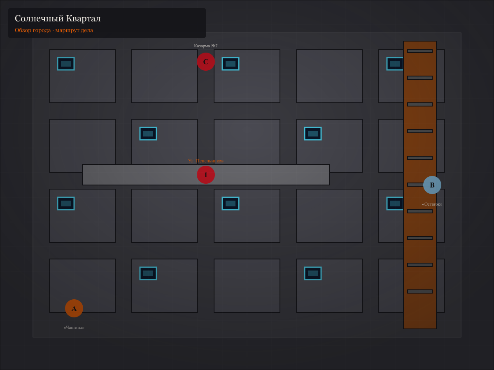
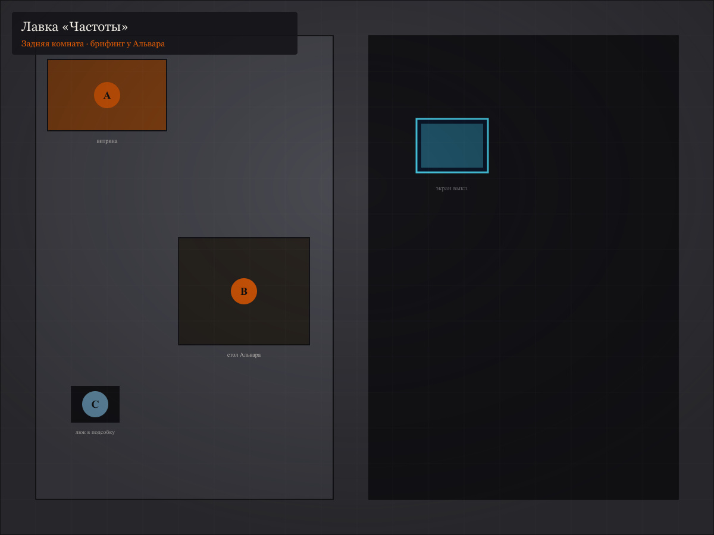
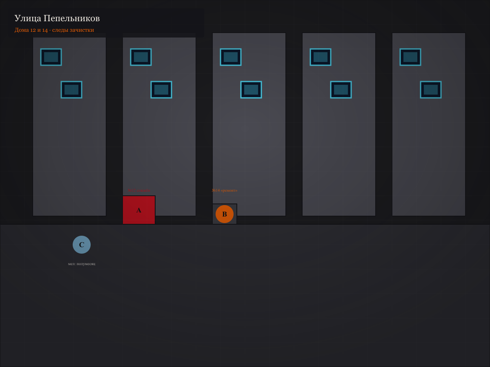
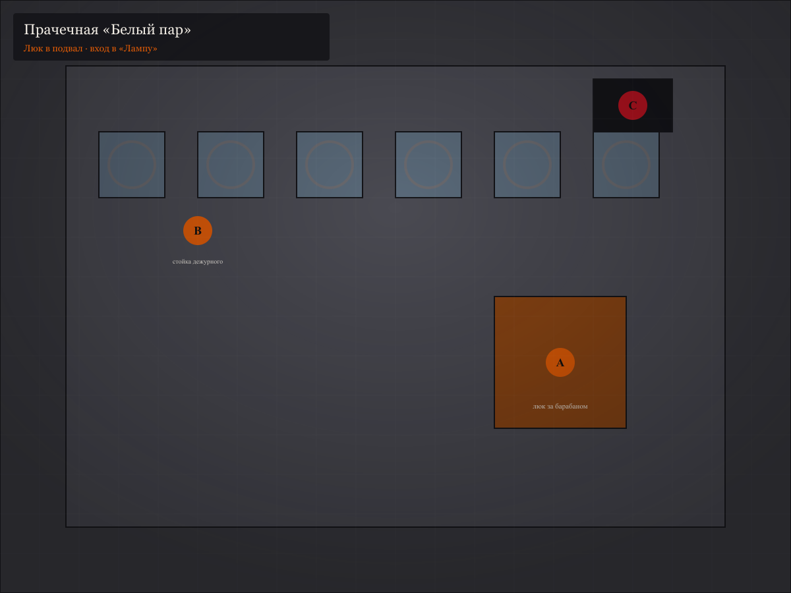
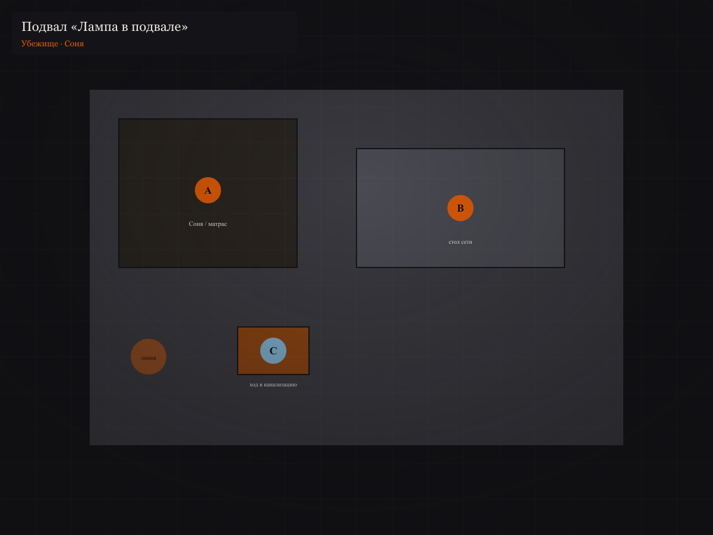
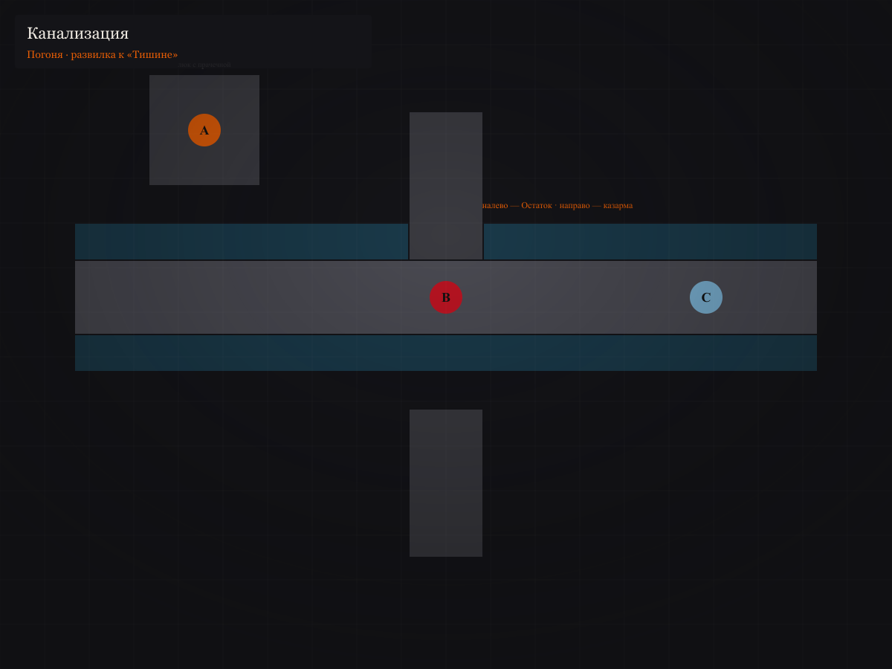
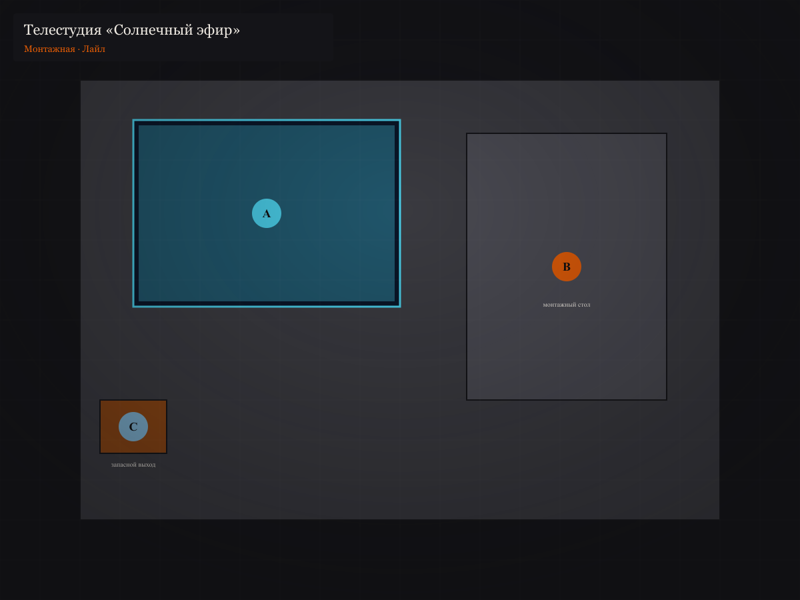
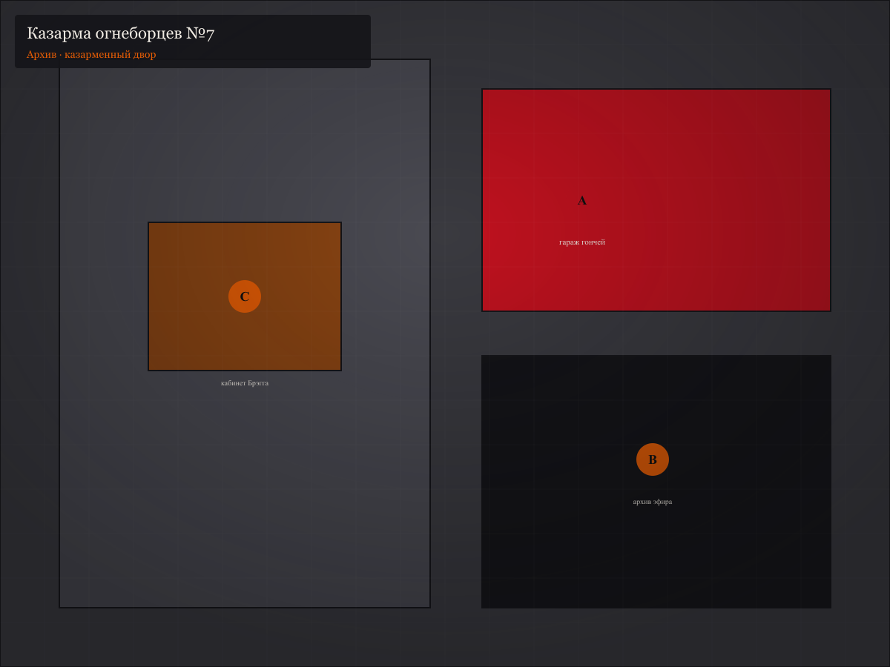
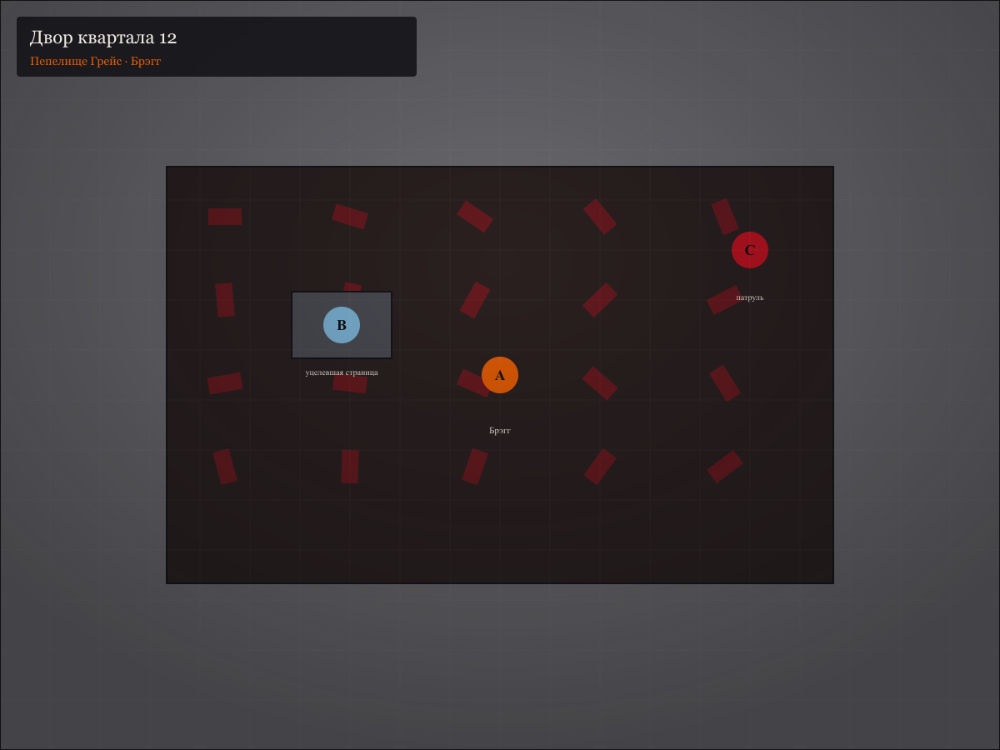
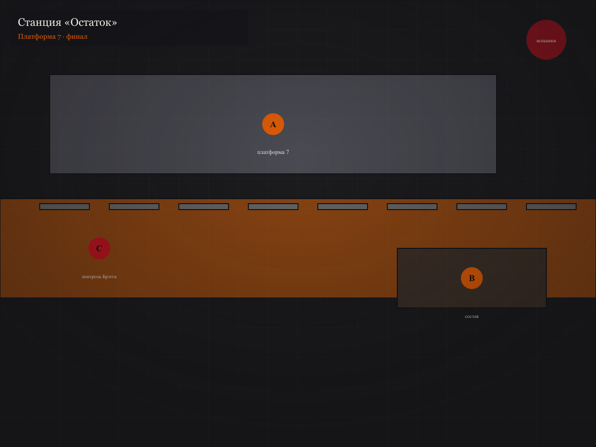

# Приключение: «Пепел слов»

*Дистопийное дело на **1–2 сессии** (по **3,5–4,5 часа** каждая) в духе «451° по Фаренгейту». Город **Солнечный Квартал** — мегаполис из бетона, телестен и запаха керосина.*

- **Жанр:** антиутопия, погоня, моральный выбор, память против огня.
- **Рекомендуемые модули:** `core`, `tactical_combat`, `equipment`, `states` (по вкусу `wounds`, `squads`).
- **Кастомный модуль:** [«Пепел и память»](../modules/fahrenheit-books.html) — Пламя, Укрытие, Страницы, живые книги.
- **Карты:** **10** battlemap в [`maps/pepel-slov/`](maps/pepel-slov/MAPS.md) (обзор города + 9 локаций). Перегенерация: `npm run build:pepel-slov-maps`.

---

# Часть I. Что произошло на самом деле (для Хранителя)

*Прочитайте до игры. Не для игроков.*

## 1) Правда в одном абзаце

В **Солнечном Квартале** книги **запрещены** уже три поколения. **Огнеборцы** сжигают не здания — **смыслы**. Неделю назад при «штатной» зачистке квартиры старухи **Грейс Миллер** она **подожгла себя** вместе с книгами — и успела **прошептать** девочке из соседней квартиры **Соне Вейн** целую **главу** запрещённого романа. Соня стала **живой книгой**. Капитан **Брэгг** понял, что в огне уцелел не только пепел: кто-то **запомнил**. Он запустил **механическую гончую** и закрыл район. Профессор **Альвар** — один из последних, кто ещё **читает по памяти**, — ищет проводников, чтобы вывезти Соню к **Людям Книги** у старой эстакады, пока город не **сожгут** «для профилактики» — и пока на горизонте не **упадут** бомбы давней войны.

## 2) Хронология

**Сорок лет назад.** После «Великого упрощения» Конгресс культурного согласия объявил книги **источником неравенства**. Огнеборцы перестали тушить пожары — они **разжигают**.

**Пятнадцать лет назад.** **Альвар** преподавал литературу; его **разжаловали**. С тех пор он живёт в **ушке наушников** и чинит радио — и **учит наизусть** то, что нельзя печатать.

**Три года назад.** **Брэгг** — звезда телеэфира и капитан казармы №7 — пишет сценарии «ночных зачисток». Он **читает** запрещённые строки **вслух** перед сжиганием, чтобы **доказать** себе превосходство. Это его **слабость**: цитата может **выбить** его из колеи.

**Год назад.** **Кларисса Энн** — соседская девочка — спрашивала «почему не смотрим на луну». Через месяц семью перевели в **«программу внимания»**. Её **нет**.

**Две недели назад.** **Грейс** отказалась отдать библиотеку. В протоколе — «сопротивление гражданина». **Брэгг** лично вёл зачистку.

**Неделю назад (ночь пожара).** Грейс зажигает керосин. **Соня** (11 лет) слышит сквозь стену **два часа** шёпота — бабушка **вкладывает** в неё **главу VII** романа *«Дом, где гаснут фонари»*. Утром Соню **не находят** дома — мать **Марион** отдала дочь **сети убежищ** («**Лампа в подвале**»).

**Сейчас.** Соня в **безопасном доме** на **Улице Пепельников, 14** — ещё **48 часов**, пока куратор не сменит адрес. Гончая **нюхает** район. **Брэгг** знает: живую книгу нельзя **показать** на экране — её нужно **стереть**. Альвар нанимает партию.

## 3) Если герои не вмешаются

- Соню **возьмут** через донос соседки с телестены.
- Брэгг **сожжёт** квартал Пепельников «как гнездо контрабанды».
- Альвар **исчезнет**; Люди Книги уйдут без **главы VII** — текст **умрёт** с девочкой или без неё.
- Через **три дня** начнётся **бомбардировка** — город **сменит** кадр на экранах, и никто не вспомнит.

## 4) Карта дела и локации



| Точка на карте | Локация | Сцена |
|----------------|---------|-------|
| **A** «Частоты» | Радиомастерская Альвара | 0 |
| **1** Пепельников | Улица, дома 12–14 | 1–2 |
| **C** Казарма №7 | Огнеборцы, архив | 4 |
| **B** «Остаток» | Станция, платформа 7 | 6 |

```
Брифинг (A) ──► Пепельники ──► Прачечная ──► Подвал ──► Канализация
                    │              │                         │
                    └─ Хойл       └─ люк                   └─ Тишина / Остаток
Казарма (C) ◄── Лайл (студия) ──► Пепелище ──► Станция (B)
```

**Три страницы** для Теста на память:

| Страница | Где | Что даёт |
|----------|-----|----------|
| **Код двери** | Альвар / Пепельники 14 | Вход без шума (−1 к ЧЦ засады) |
| **Голос Грейс** | Соня в подвале | +2 к социальному удару по **Брэггу** (один раз) |
| **Расписание эстакады** | Лайл / архив казармы | Окно **03:40**, п. **7**; знание о **доп. проверке** |

---

# Часть II. Перед первой сессией

## 1) Тон и договор

- История про **цену памяти**: нельзя спасти всё и всех.
- Огонь и шум **разгоняют** Пламя; тихие ходы **дороже**, но **живут дольше**.
- Самосожжение Грейс — **за кадром** (воспоминание Сони) или **вспышка** в начале сцены 1 — решите до игры.
- Телестены: правило **Парламента стен** (модуль) — честный разговор дома у Хойл **стоит** Пламя.

## 2) Кто такие герои

| Вариант | Крючок | Первая реплика мира |
|---------|--------|---------------------|
| **Курьеры «Лампы»** | Знак полумесяца, пароль от Альвара | Пепел встречает настороженно, но впускает |
| **Сомневающийся огнеборец** | Приказ на Пепельники 14 | Альвар смотрит на форму и **не** зовёт стражу |
| **Соседи Клариссы** | Ищут девочку | Хойл путает их с «программой внимания» |
| **Техники эфира** | Видели «лишний» голос в записи | Лайл сам выходит на контакт в сцене 4 |

## 3) Счётчики

- **Пламя** **1**
- **Укрытие** **2**
- **Страницы** **0**

## 4) План сессий

| Сессия | Сцены | Карты |
|--------|-------|-------|
| **1** «Запах керосина» | 0 → 3 | 01–05 |
| **2** «Люди, которые помнят» | 4 → 6 | 06–09 |

---

# Сессия 1. «Запах керосина»

**Баланс:** социалка и разведка **40%**, погоня и давление **60%**.

---

## Сцена 0. Радиомастерская Альвара

**Карта:**



**Маркеры:** **A** — витрина (маскировка); **B** — стол брифинга; **C** — люк в подсобку (запасной выход, **Укрытие −1** — спрятать одного человека).

### Антураж

Вечер. Улица **Тихих частот** пуста: соседи **смотрят** — значит, **не слушают**. В витрине «Частоты» — сломанные приёмники и **плакат**: *«Счастье на расстоянии вытянутой руки»*. За дверью **нет** звонка — только **три стука**, пауза, **два**.

Пахнет **пылью ламп**, **пайкой** и **керосином** с ветра. Телевизор в углу **выключен** — на экране отражается комната, как **чёрное зеркало**.

### Вход

Если партия **стучит правильно** (Альвар сказал по телефону-рации / через контакт):

**Голос изнутри:** «Входите. **Медленно**. И **не** говорите фамилии — стены **любят** фамилии.»

Если **ломают** или **шумят**:

**Альвар** *(из подсобки, дробно)*: «Вы **привели** гончую **или** мозги? Выберите **быстро**.»

Проверка **Скрытность ≥ 11** — вошли без **+1 Пламя**; провал — патруль **мимо** услышал грохот.

### Брифинг

**Альвар** — седой, **сухие** руки, наушник на **одном** ухе (второе — «для тишины»). Говорит **тихо**, как **читает** по строкам.

**Альвар:** «Добрый вечер. Вы пришли **не** за радио — хорошо: я **чиню** эфир, а не **души**. Садитесь. *кладёт на стол карту района — не ту, что у вас в книге, а выцветшую, настоящую* Вот **Пепельники**. Дом **четырнадцать**. Там **девочка**. Её зовут **Соня Вейн**.»

Пауза. Он **не** смотрит в глаза — смотрит на **ваши руки**.

**Альвар:** «Соня **помнит** текст, которого **нет** в мире. Главу VII. Роман *„Дом, где гаснут фонари“*. Бумагу **сожгли** с бабушкой **Грейс**. Огню осталась **обида** — и **ребёнок**. Через **сорок восемь часов** адрес **сгорит** — буквально: капитан **Брэгг** назначил **профилактику** на рассвет. Ваша задача — **довести** её до станции **„Остаток“**, платформа **семь**, **03:40**. Там **Люди Книги**. Я **не иду**: меня **узнают** за **три квартала**.»

### Вопросы и ответы

| Вопрос | Ответ Альвара |
|--------|----------------|
| Почему мы? | «Потому что вы **ещё** не сгорели. И потому что **я** больше **не бегаю**.» |
| Кто такой Брэгг? | «**Лицо** закона. **Голос** на экране. Он **читает** перед сжиганием — **для себя**. Не **повторяйте** это ему. Или **повторите** — если готовы **платить**.» |
| Сколько платите? | «**Страницами**. У меня в голове — *Платон*, *Братья К…*, кусок **Евангелия**. Выберете **абзац** — я **диктую** один раз. Больше **не** предлагайте денег: деньги **пахнут**.» |
| Где мать? | «**Марион** отдала дочь **сети**. Сама **осталась** — чтобы **отвлекать**. Её **не трогайте**: если возьмёте — **Пламя** взлетит, а Соня **замолчит** от страха.» |
| Гончая? | «Слышите **скрежет** — **бегите**. Не **стреляйте** в неё **на улице**. Она **не** собака. Она **доказательство**.» |

### Если партия — огнеборцы

Альвар **бледнеет**, но **не** зовёт помощь.

**Альвар:** «Форма у двери. Я **думал** — пришли **сжечь** старика. *долгая пауза* …Может, **пришли** услышать. В **протоколе** вчерашнего рейда — **ошибка**. Квартира **14** — не **склад**. Там **ребёнок**. Вы **видели** пепел **когда-нибудь** близко? Там **остаётся** тепло **долго**. Иногда — **слова**.»

**Воля ≥ 12** или честный ответ «мы **не** уверены в приказе» — он **доверяет** код двери. **Обман** (провал) — даёт **ложный** адрес (+1 сцена потерянного времени).

### Страница: код двери

**Внимание / Анализ ≥ 10** — под ковриком **записка**: *«Три удара — пауза — два. Фонарь гаснет дважды.»*

Или Альвар отдаёт за **обещание** спасти Соню:

**Альвар:** «Пароль **сети** сегодня — как у **Грейс**: *фонарь гаснет дважды*. Повторите. *ждёт* …Хорошо. Берите. И **не** говорите его **громко** — слова **тяжёлые**.»

→ **Страница: Код двери**.

### Уход

**Альвар** *(у двери)*: «Если **не** успеете — **не** приходите **извиняться**. Приходите **помнить**. И **ещё**: на Пепельниках **не** верьте **смеху** с экранов. Смех там **записан** **вчера**.»

---

## Сцена 1. Улица Пепельников

**Карта:**



**Маркеры:** **A** — обугленный подъезд **№12**; **B** — подъезд **№14** (табличка «ремонт»); **C** — мел полумесяца у газона.

### Антураж

Сумерки. **Серые** башни, на **каждом** балконе — **экран**: один и тот же **ситком**, один и тот же **смех**, рассинхрон на **полсекунды** между домами. Воздух **сладковатый** — керосин и **мокрый пепел** в ливнёвках после пожара **Миллер**.

У подъезда **12** — **чёрная** дверь, пузырится краска. На **асфальте** — жёлтая лента «**Не пересекать**», уже **порвана** детьми. У **14** — свежая **белая** табличка «**Ремонт**», а за ней **свет** в окне **третьего** (на самом деле — **пусто**, ловушка наблюдения).

### Осмотр №12 (пепелище)

**Разум / Внимание ≥ 10:**

- Запах **не** дымовой — **химический** (ускоритель горения).
- На косяке — **отпечаток перчатки** огнеборца, **не** гражданский.
- Внутри (если **вломились** или **подкупили** сторожа) — **зола** в форме **книжного** корешка.

**Разум / История ≥ 11** — на обгоревшей полке **царапина**: кто-то **вырезал** инициалы **Г.М.** **до** пожара.

Шум внутри → **+1 Пламя**, соседи **выглядывают**.

### Осмотр №14 и знак сети

**Внимание ≥ 11** у **C** — мелом на плитке: **полумесяц** (внизу — цифра **2**, смена караула через **2 часа**).

**B**, подъезд: замок **новый**. Код — **стук**: три — пауза — два; или фраза у двери **шёпотом**.

Неверный код → с **верхнего** этажа **мигает** шторка (**сигнал** Хойл). **+1 Пламя**.

### миссис Хойл (парламент стен)

Из окна **напротив** — женщина **лет шестидесяти**, на плече **планшет-экран** как **второе лицо**. Глаза **бегают** между вами и **объективом**.

**Хойл:** «Вы **кто**? Огнеборцы **уже** были. Я **ничего** не говорила. *громче, для экрана* Мы **любим** наш город! *шёпотом* …Уходите. Здесь **плохо** пахнет. Не **только** керосином.»

| Ход игроков | Реакция |
|-------------|---------|
| Успокоить, **Эмпатия / Дипломатия ≥ 11** | «Девочку **увезли**. **Правильно**. В **прачечне**… *зажмуривает глаза* …я **не** говорила.» → намёк на люк |
| **Социальный удар** (Воля + навык) | См. модуль; уступчивость **Частично** → код «фонарь гаснет дважды» |
| Угрозы, крики | **Парламент стен** — провал автоматический **+1 Пламя**; Хойл **жмёт** «тревога» на планшете |
| «Где Кларисса?» | Лицо **каменеет**: «Девочка **слушала** луну. Луну **отключили**. Не **ищите** луну.» |

**Хойл** *(если сдалась, почти беззвучно)*: «Через **прачечную**. Люк за **третьим** барабаном. Сегодня — как у **Грейс**: *фонарь гаснет дважды*. Я **не** видела вас. **Никогда**.»

→ **Страница** (маршрут), если ещё не было кода.

### Кларисса (опциональный след)

**Внимание ≥ 12** у мусорных баков — **рисунок** мелом: луна с **перечёркнутым** ухом. На обороте **билета** в «программу внимания» — имя **Энн**.

Это **не** улика механики — **атмосфера** и крючок на кампанию.

### Переход

Гул **сирен** вдали. На экранах **ситком** сменяется **новостью** (без звука — субтитры): *«Профилактика — забота о вас»*.

---

## Сцена 2. Прачечная и подвал «Лампа»

**Карты:**





**Прачечная:** **A** — люк; **B** — стойка дежурного; **C** — служебный коридор (патруль при **Пламя ≥ 3**).

**Подвал:** **A** — Соня; **B** — стол сети; **C** — ход в канализацию.

### Прачечная «Белый пар»

Пар **белый**, пахнет **хлором**. Гул **барабанов** — хорошая **маскировка** разговоров. Дежурный **Юрий** — **сонный**, **наушники** (слушает **разрешённый** плейлист).

**Юрий** *(не снимая наушников)*: «Стиралка **три** — **занята**. Четырнадцать **часов** минимум. Монеты **слева**.»

| Ход | Исход |
|-----|--------|
| Монеты + **Скрытность ≥ 10** мимо стойки | К **A** без вопросов |
| Пароль + знак полумесяца | Юрий **кивает** на барабан **3**, **не** поднимает глаз |
| «Огнеборцы, обыск» (Обман ≥ 12) | Пускает; провал → **зовёт** соседа с **C** |
| Код двери (страница) | Люк **открыт** на **щель** — **−1** к ЧЦ засады в подвале |

За **третьим** барабаном — **люк**, **ржавый**. Стук: три — пауза — два. Шёпот: *«Фонарь гаснет дважды»*.

### Встреча «Пепел» и «Искра»

Внизу — **лампа** с **синим** пламенем (химия сети). **Пепел** — женщина в **рабочей** куртке. **Искра** — молодой, **нервный**, **ключи** на поясе.

**Пепел:** «Стоп. **Лица** новые. Знак или **слово**.»

**Искра:** «Пепел, если это **они** — пусть **говорят** быстрее. **Гончая** **кружит** **второй** круг.»

Правильный пароль / код →

**Пепел:** «Альвар **ещё** жив? *вздох* Хорошо. **Девочка** — в углу. **Не** жмите её **вопросами**. Она **полна** — как **стакан** до краёв.»

Провал → **Искра** тянется к **тревоге**; бой **не нужен** — достаточно **социального удара** или **Укрытие −1** («мы **платим** дорогой»).

### Соня

**Антураж:** матрас, **книга-рисунок** (пустая), **плед**. Соня **11 лет**, **не** плачет — **слушает** внутрь себя, губы **шевелятся**.

**Соня:** «Вы **пришли** за **главой**? Она **не** вылезает. Она **внутри**. Бабушка сказала: когда **фонарь** погаснет **в третий** раз — **беги**. Два раза **уже** было.»

| Вопрос | Ответ |
|--------|--------|
| Что помнишь? | Шёпотом **цитирует** 2–3 строки (*«…и фонарь у двери дрожал, как будто боялся тьмы…»*) — **не все слова** понимает |
| Где бабушка? | «Она **осталась** **гореть**. Чтобы **огонь** не пошёл к **маме**.» |
| Кто вы для неё? | «Вы — **полка**. Пока **держите** — глава **не** падает.» |

**Страница: Голос Грейс** — если игроки **терпеливо** слушают (**Воля ≥ 10** или 10 минут игрового времени без угроз):

**Соня:** «Бабушка **пела** слова **между** строками. *поёт шёпотом* …Это **не** моё. Это **её**. Но теперь **моё**.»

→ +2 к первому социальному удару по **Брэггу**.

**Живая книга:** пока Соня с партией — текст **не найдут** при обыске.

### Тревога: гончая

**Искра** *(бледнеет)*: «Слышите? **Скрежет**. **Иглы** по **стеклу**. Она **у** люка.»

**Пепел:** «**Канализация**. **Соня** — в **центре**. **Взрослые** — **кругом**. **Не** светить. **Не** стрелять. **Искра**, веди.»

**Укрытие −1** — отвлечь гончую **ложным** следом (Искра **не** пойдёт — **отряд** или NPC-жертва по согласию стола).

→ **Сцена 3**.

---

## Сцена 3. Канализация и клиффхэнгер

**Карта:**



**Маркеры:** **A** — люк с прачечной; **B** — развилка (налево **Остаток**, направо **казарма**); **C** — выход в район **Тишина**.

### Антураж

Темно. Вода **по щиколотку**, **жир** и **ржавчина**. Эхо **шагов** **умножается**. Сзади — **скрежет**; впереди — **свет** редких **решёток** наверху.

### Погоня (три броска)

`2d6 + Ловкость + скрытность` против **10 + Пламя** каждый раунд «отрыва».

| Итог | Событие |
|------|---------|
| **Успех** | Отрыв; описание **ужаса** без механики |
| **Провал** | **+1 стресс** ближайшему; гончая **ближе** |
| **3 провала** | **Бой** с гончой **или** патруль у **C** |
| **3 успеха** | **−1 Пламя**, след **сброшен** |

**Искра** *(на развилке **B**)*: «**Налево** — **Остаток**, **долго**, но **тихо**. **Направо** — мимо **казармы** — **быстро**, **если** вам **нравится** смерть. Я **налево**.»

### Выход

**C** — решётка в **Тишину**. Пепел **остаётся** (или **уходит** — по вашему сюжету). **Соня** **с вами**.

На поверхности — **сирены**. Громкоговоритель **Брэгга** (голос **теплый**, как **добрый** отчим):

**Брэгг:** «Граждане **Пепельников**! Завтра на **рассвете** — **профилактическое** сжигание **заражённого** квартала. Кто **укрывает** **контрабанду мысли** — выйдите **добровольно**. Вам **обещают** **эфир** и **снисхождение**. Кто **молчит** — **содержание** для **ночного** выпуска. **Спите** хорошо. **Счастье** близко.»

**Соня** *(вздрагивает)*: «Третий раз… фонарь…»

**Конец сессии 1.**

---

# Сессия 2. «Люди, которые помнят»

---

## Сцена 4. Архив эфира (Лайл) или казарма

Выберите **один** путь (или оба, если время есть).

### Вариант А — телестудия (рекомендуется)

**Карта:**



**A** — экран записи; **B** — монтаж Лайла; **C** — запасной выход.

**Антураж:** Ночь. Коридоры **пустые** — техники **на смене** у **монтажа**. На **A** — **замороженный** кадр: **Грейс** в огне ( **запикано** ); в **аудиодорожке** — **детский** смех (**вырезан**).

**Лайл** — **30 лет**, **усталые** глаза, **бейдж** «Солнечный эфир».

**Лайл** *(не оборачиваясь)*: «Если вы **огнеборцы** — я **уже** **сдал** диск. Если **не** огнеборцы — **закройте** дверь. **Брэгг** **режет** **правду** **кадр** за **кадром**.»

| Вопрос | Ответ |
|--------|--------|
| Что на диске? | «**Сырой** звук с **Пепельников**. **Голос** ребёнка **сквозь** стену. Капитан **вырезал** — сказал: *„Память — вирус“*.» |
| Чего хотите? | «**Выход**. **Остаток**, **03:20**. **Не** на поезде — **внутри** **служебного** вагона. Я **устал** **монтировать** **ложь**.» |

**Грязная сделка:**

- **Цена:** провести Лайла к поезду **с** Соней.
- **Залог:** если **сорвёте** — он **сдаст** вас ( **+2 Пламя** ).
- **Свидетель:** монтажёр **Рико** (можно **купить** за **Укрытие −1**).

Бросок `2d6 + Воля + переговоры` ≥ **12** — см. модуль.

**Успех** → **Страница: Расписание** + **флешка** (сырой звук — **рычаг** против Брэгга: «эфир **врёт**»).

**Провал** — сделка **всё равно**, но **Рико** **шпионит** → засада у станции.

### Вариант Б — казарма №7

**Карта:**



**C** — кабинет Брэгга; **B** — архив; **A** — гараж гончей.

Для **огнеборцев** в партии: **подделать** отчёт — `2d6 + Разум + администрирование` ≥ **13**.

- **Успех:** **Расписание** + **−1 Пламя** (вас **не** ждут на станции).
- **Провал:** Брэгг **знает** → **сцена 5** **обязательна**.

---

## Сцена 5. Брэгг у пепелища

**Карта:**



**A** — Брэгг; **B** — уцелевшая страница в золе; **C** — патруль (вмешивается при **шуме**).

### Антураж

Рассвет близко. Двор **12** — **чёрная** корка, **тепло** идёт от **земли**. Небо **оранжевое** — не **солнце**, **пожары** в **другом** районе. Брэгг **без** шлема, **руки** в **перчатках**, в **пальцах** — **обугленный** лист.

**Брэгг:** «А. **Зрители**. Опоздали на **спектакль** — **старуха** **сожгла** **себя** **без** **дублёра**. **Благородно**. **Глупо**. **Красиво** — **все** три сразу.»

Он **поднимает** страницу:

**Брэгг:** «Одна **строка** **уцелела**. *„Фонарь у двери дрожал…“* — **смешно**. Фонари **не** **дрожат**. Ими **управляют**. Как **вами**. Где **девочка**?»

### Диалоговые ветки

**«Мы не знаем»** (Обман ≥ 13):

**Брэгг:** «**Врёте** **плохо**. Я **учил** **врать** **лучше** — по **учебникам**, **которые** **сжёг**.» → уступчивость не меняется.

**Социальный удар** + **Голос Грейс** (страница, +2):

**Брэгг** *(цитата Сони **дословно**)* — **замирает**. Голос **трескается**:

**Брэгг:** «…Она **учила** **так** **же**. **Старуха**. *сжимает* страницу* …Я **тоже** **помню** **строки**. **Поэтому** **жгу**. Чтобы **не** **помнить** **громко**.»

Урон ≥ 3 → **Ключевое**: даст **5 минут** форы **или** **пропустит** к станции **без** сирены.

**«Заберите нас в эфир»** (циничный ход):

**Брэгг** *(оживляется)*: «Наконец **разумные**. **Соня** — **в кадр**. Вы — **герои** **зачистки**. *холоднеет* …Нет. **Живую** **книгу** **в** **эфир** **нельзя**. Она **заразит** **субтитрами**.»

### Бой

Если **бьют** или **Пламя ≥ 4** — **Брэгг** + **2 огнеборца** с **C**.

**Публичная** победа → **+2 Пламя**. **Тихий** уход → **Тест на память** перед сценой 6.

**B** — если взять страницу: **+1 стресс** (магический **шёпот** Грейс), но **−1** к ЧЦ Брэгга в **следующей** сцене.

---

## Сцена 6. Станция «Остаток», 03:40

**Карта:**



**A** — платформа 7; **B** — состав Людей Книги; **C** — контроль Брэгга (если **не** сняли в сцене 4–5).

### Антураж

Ржавые **пути**. **Туман**. **Один** состав, **фонари** **мигают**. На **горизонте** — **вспышки** (война). Ветер **пахнет** **пеплом** и **маслом**.

**Гриффин** — **пятеро** в **плащах**, лица **в тени**. Голос **ровный**, как **аудиокнига**.

**Гриффин:** «Вы **опоздали** на **минуту**. Минуту **в** **этом** **городе** **легко** **сжечь**. Девочка — **глава** **VII**?»

**Соня** *(кивает, шёпотом диктует* **одну** строку**)*.

**Гриффин:** «Достаточно. Мы **не** **спасаем** **людей**. Мы **спасаем** **то**, **что** **они** **помнят**. Кто **примет** **хвост** **главы** — **станет** **вторым** **томом**. Кто **нет** — **садится** **в** **вагон** **или** **возвращается** **в** **ложь**. **Минутa**.»

### Если Брэгг на **C**

**Брэгг:** «**Кадр** **готов**. **Соня** — **сюда**. Остальные — **на** **колени** **или** **в** **огонь**.»

Развилка: **бой**, **обмен** (список убежищ за Соню), **сырой** диск Лайла (**социальный** удар с **+2**).

### Таблица исходов

| Исход | Последствия |
|-------|-------------|
| **А. Соня уехала** | Текст **спасён**; Пепельники **сгорели**; **+1 Укрытие** |
| **Б. ПК — живая книга** | Передача главы (модуль §1.3); Соня **свободна**; **+2 стресса** |
| **В. Сдали Соню** | **+3 Пламя**; Альвар **пропал**; эфир **празднует** |
| **Г. Брэгг на платформе** | Бой / обмен; цена — **жизнь** или **сеть** |
| **Д. Война** | Бомбы **падают**; эвакуация **сорвана** — **бегство** с **одной** страницей в **голове** |

### Эпилог

**Письмо Альвара** (приходит **через** **неделю**, **пахнет** **дымом**):

«Не спрашивайте, **что** **книга** **делает**. Спросите, **что** **вы** **готовы** **помнить**, **когда** **её** **не** **станет**. **Фонарь** **погас** **в** **третий** **раз**. **Город** **ещё** **горит** **на** **экранах**. **Мы** — **нет**.»

На **радио** — **сбой**: **три** секунды **тишины** вместо **смеха** ситкома. Кто **помнит** — **улыбается**.

---

# Бестиарий приключения

## Огнеборец

- **Угроза:** низкая · **Тело 3, Ловкость 2, Разум 1, Воля 2** · **Раны 6** · форма **+1** к ЧЦ  
- **Огнемёт (Даль) +2** — при попадании **+1 Пламя**  
- **Реплики:** «Закон **теплый**. Не **обжигайтесь**» / «Книги **не** **кричат** — **вы** **кричите**»

## Огнеборец-ветеран

- **Угроза:** средняя · **Тело 3, Ловкость 3, Разум 2, Воля 3** · **Раны 8**  
- **Топор +2**, **сеть** (сбить с ног)  
- **Реплика:** «Мы **не** убиваем. Мы **очищаем**»

## Капитан Брэгг

- **Угроза:** высокая · **Тело 3, Ловкость 2, Разум 4, Воля 5** · **Раны 10**  
- **Огнемёт +3**, пистолет **+1**  
- **Особое:** цитата из *«Дом, где гаснут фонари»* — **−1 Воля** на сцену (не ниже 3)  
- **Любимая** тайная книга — *«Этюды в зелёном и пурпурном»* (если процитируют — **замешательство**)

## Механическая гончая

- **Угроза:** высокая · **Тело 3, Ловкость 4** · **Раны 10** · укус **+2**  
- Погоня — модуль §7; звук: **иглы** по **стеклу**

---

# Шпаргалка ведущего

| NPC | Ступень | Заметка |
|-----|---------|---------|
| Альвар | — | не предаёт; платит **памятью** |
| Соня | доверие | **не** разбивайте **стакан** |
| Брэгг | Закрыт → Ключевое | **помнит** — **жжёт** |
| Хойл | Закрыт / Частично | **боится** экрана |
| Пепел / Искра | — | **Искра** ведёт в **канализацию** |
| Лайл | сделка | **не** герой — **устал** |
| Гриффин | — | **только** выбор |

**Одна сессия:** начните с **сцены 2**, сократите **4А**, финал под **обстрелом**.

**Карты:** [галерея](maps/pepel-slov/MAPS.md) · `npm run build:pepel-slov-maps`
