# Приключение: «Зов из Чёрного шпиля»

*Тёмное фэнтези для «Корней судьбы» на **1–2 сессии** (по **3,5–4,5 часа**). Полная версия для ведущего: **~20 страниц** текста и таблиц + **11** battlemap + **14** слотов под иллюстрации (см. части IX–X). Королевство **Вестмар**, башня **Чёрный шпиль** на скале у **Пепельных болот**.*

- **Жанр:** тёмное фэнтези, ловушка для героев, дракон, ложная принцесса.
- **Тон:** сказка **ломается** — хэппи-энда **нет**, принцессы **давно нет**.
- **Рекомендуемые модули:** `core`, `tactical_combat`, `magic`, `equipment`, `fantasy_bestiary`, `states` (по вкусу `wounds`, `squads`).
- **Кастомный модуль:** [«Эхо сказки»](../modules/hero-trap.html) — Сказка, Зов, Трещины, голос-искушение.
- **Карты:** **11** battlemap в [`maps/chernyy-shpil/`](maps/chernyy-shpil/MAPS.md) (обзор + 10 локаций). Перегенерация: `npm run build:chernyy-shpil-maps`.
- **Совместимость:** без модуля ведите счётчики нарративно (см. шпаргалку в конце).

---

# Часть I. Что произошло на самом деле (для Хранителя)

*Прочитайте до игры. Не для игроков.*

## 1) Правда в одном абзаце

**Принцесса Элара** умерла **сорок семь лет назад** — **малая чума**, ей было **семь лет**. Придворный архимаг **Терон** не принял смерти и попытался **удержать эхо** в **хрустальном колоколе**. Эхо **выцвело**. Тогда он заключил пакт с драконом **Пепельницей**: она **охраняет** шпиль, он **кормит** её неудавшимися «спасителями» и **питает** иллюзию **детским плачем** через **Зеркало душ**. Уже **тринадцать** отрядов пришли «спасти» её; **двенадцатый** до сих пор **ходит** по башне — **полый рыцарь**. Король **Осрик мёртв** (склеп под часовней). **Королева-мать Милдред жива** — и **знает**. Она **подписывает** каждый поход, потому что Терон даёт ей **«Молочный сон»**: раз в месяц она **слышит** дочь во сне. Без новых «спасителей» эхо **слабеет** — и мать **забудет** голос. Ловушка держится на **двух** опекунах: **магии** и **материнской отчаянной лжи**.

## 2) Хронология

**73 года назад.** Рождение **Элары** — единственного ребёнка короля **Осрика** и королевы **Милдред**.

**47 лет назад.** **Малая чума** в столице. Элара умирает за **три дня** на руках **Милдред**. Терон **запрещён** некромантией; он уходит в **Чёрный шпиль**. Милдред **проклинает** его — потом **просит** вернуть **хоть звук**.

**46 лет назад.** Пепельница заключает пакт с Тероном. Милдред **впервые** слышит «голос» в колоколе — **плачет** всю ночь и **верит**.

**35 лет назад.** Осрик умирает (горе и яд). Милдред **отказывается** от регентства в пользу Терона: «Я **мать**, не **правительница**». На деле — не выносит двора **без** дочери.

**30 лет назад.** Колокол эха **перестаёт** звучать сам. Терон строит **Зеркало душ**. Милдред **подписывает** первый **тайный** указ о «добровольцах». Она **видела** пустую **кровать** в шпиле — и **всё равно** подписала.

**Пять лет назад.** «Молочный сон» **слабеет**. Милдред пишет Терону: *«Ещё один отряд. Я **не слышу** её. Сделай что должен»*.

**Год назад.** **Двенадцатый** отряд — рыцарь **Годвин** и трое. Годвин **дошёл** до зеркала, **понял**, но **не успел** разбить — стал **полым**. Остальные **мёртвы**; дракон **сыт**.

**Сейчас.** Терон нанимает **тринадцатый** отряд — партию. **Голос** снова «зовёт» с верхнего яруса. **Пепельница** устала; она **не** защищает ложь — только **контракт** и **добычу**.

## 3) Если герои не вмешаются

- Очередной «спаситель» **станет** топливом зеркала.
- **Голос** усилится — в королевстве начнутся **детские сны**; новые отряды пойдут **сами**.
- **Пепельница** через год **сорвёт** пакт и **сожжёт** болота — деревни **сгорят**, правда **не всплывёт**.

## 4) Карта дела

```
Брифинг (дворец/регент) ──► Край Оврага ──► Холм щитов ──► Врата шпиля
        │                         │              │
        └─► Трещины (улики)       └─► Болото     └─► Часовня / Галерея
                                              │
                    Сессия 2 ◄── Зов растёт ◄─┘
                         │
              Мост Пепельницы ──► Комната «принцессы» ──► Терон / Зеркало
```

**Пять трещин** (модуль `hero_trap`):

| Трещина | Где | Что даёт |
|---------|-----|----------|
| **Список тринадцати** | таверна «У Безымянного» | имена **12** прошлых отрядов; **Годвин** без даты возврата |
| **Портрет не той эпохи** | галерея 2-го яруса | платье **старше** 47 лет; **−1** к иллюзии голоса |
| **Письмо матери** | склеп часовни / сундук в галерее | Милдред **знала** и **посылала** героев **сознательно** |
| **Пепельница говорит** | мост дракона | «**Она** перестала **плакать** до **вашего** рождения» |
| **Пустая кровать** | комната принцессы | зеркало **не** отражает принцессу — отражает **вас** |

## 5) Счётчики

- **Сказка** **3**.
- **Зов** **0**.
- **Трещины** **0**.

---

# Часть II. Перед первой сессией

## 1) Тон и договор

- Обещание «спасти принцессу» **не сбудется**. Подготовьте стол: цель — **правда**, **выживание**, **цена**.
- Насилие **не зло** само по себе, но **клятвы** и **жертвы ради Элары** кормят ловушку.
- Обсудите: насколько телесен **хоррор** зеркала (за кадром / намёк / полное описание).

## 2) Кто такие герои

| Вариант | Крючок |
|---------|--------|
| **Королевские искатели** | Вызов от **регента Терона** (и **королевы Милдред** — вариант B) |
| **Наёмники** | Объявление в столице: печать **двух** властей — регент **и** королева-мать |
| **Паломники** | Сон **девочки в серебре** — общий для всей партии |
| **Ошибка карты** | Искали **драконье логово** сокровищ — нашли **шпиль** |

## 3) План сессий

| Сессия | Название | Фокус |
|--------|----------|-------|
| **1** | «Тринадцатый отряд» | брифинг, дорога, нижние ярусы, **голос**, ловушка |
| **2** *(опционально)* | «Комната без принцессы» | дракон, зеркало, Терон, финал |

*В **одну** длинную сессию: сократите болото, начните у **врат**, финал — **зеркало**.*

---

# Сессия 1. «Тринадцатый отряд»

**Баланс:** исследование и разговоры **45%**, засады и напряжение **55%**.

## Сцена 0. Брифинг (крючок)

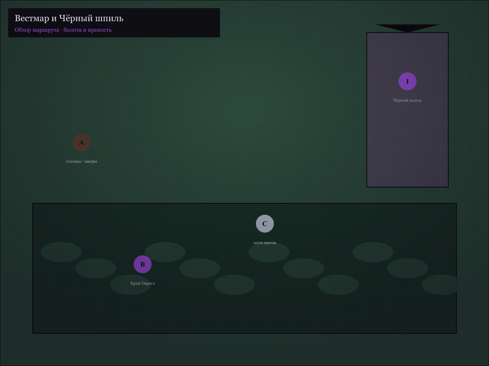

### Вариант A — шатры у Каменного моста

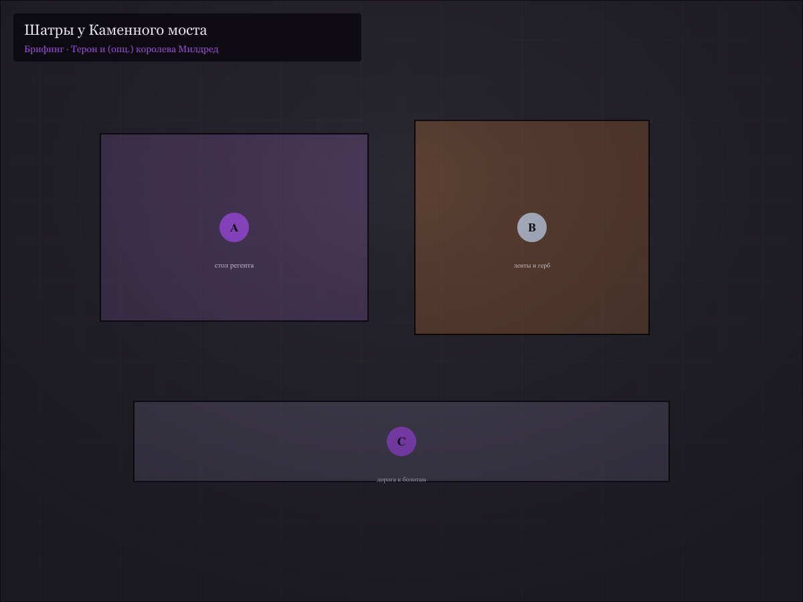

**Место:** тканевые шатры, герб Вестмара **потёрт**. Пахнет дождём и воском. **Только Терон.**

**Терон:** «Вы — **тринадцатые**, кого я **осмеливаюсь** просить. **Пепельница** увела **дочь** покойного короля в **Чёрный шпиль**. Голос **Элары**… *срывается* …слышен **по ночам**. Прошу **добраться** до **верхней** комнаты и **вернуть** её — или **положить** венок, если… если **поздно**. **Клянётесь** **не бросить** её?»

### Вариант B — тронный зал, королева присутствует

**Место:** тот же брифинг, но в **столице**; на троне рядом с пустым **королевским** сиденьем — **Милдред**.

**Милдред** — седая, **прямая** спина, руки **сжаты**. Говорит **тише** Терона.

**Милдред:** «Мой муж **давно** **не** с нами. **Я** встала **одна**. *кладёт на стол **серебряную** ленту* Это **носила** Элара. Верните… **коснувшейся** её руки. Или **положите** на **подушку**. Я **мать**. Я **не** прошу **чуда**. Я прошу **попытки**.»

Если **Проницательность ≥ 12** у Милдред — она **не** смотрит на ленту, смотрит на **свои** ладони.

**Терон** *(мягко, если герои колеблются)*: «Её величество **не спит** **третью** неделю. **Вы** — **надежда** короны.»

*(Двойная ложь: надежда **короны** — **топливо** зеркала.)*

---

**Общее для A и B**

Если спросят про прошлых героев:

**Терон:** «Двенадцать **отважных**. Некоторые **вернулись** с **ранами**… *пауза* …остались **стражами** чести. **Не** думайте о них. Думайте о **ребёнке**.»

**Милдред** *(только вариант B, если спросят прямо)*: «Каждый… **доброволец**. Я **молилась** за **каждого**.» *(Правда: молилась **за себя** — чтобы **снова услышать**.)*

Если **Проницательность ≥ 12** у Терона — смотрит **мимо** глаз на слове «ребёнок».

**Клятва вслух** → **+1 Сказка**. **Принять ленту** от Милдред → **+1 Сказка** и **метка** (зеркало **узнаёт** вас в сцене 9).

---

## Сцена 1. Край Оврага, таверна «У Безымянного»

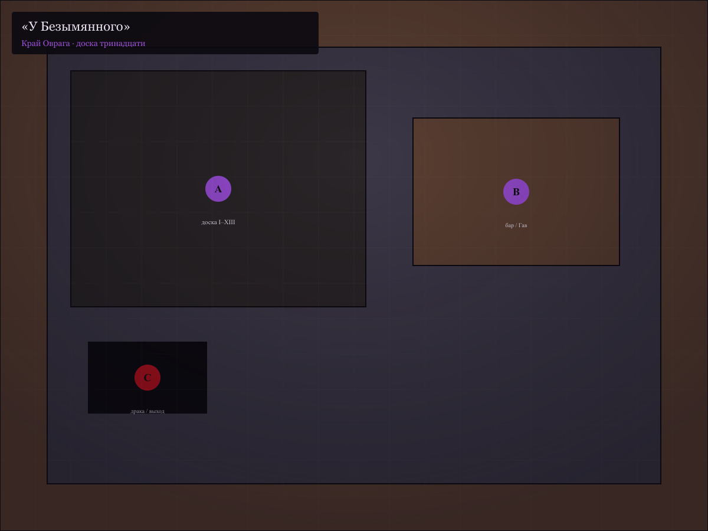

**Антураж:** последняя деревня перед болотом. На стене — **доска** с гвоздями и **номерными** жетонами.

**Хозяин Гав** — одноглазый, бывший оруженосец **одиннадцатого** отряда.

**Гав:** «Тринадцатый, значит. *сплёвывает* Ставлю **медяк** — **не** дойдёте до **моста**. Или дойдёте — и **услышите** то, что **слушать** нельзя.»

**Внимание / История ЧЦ 10** — доска: **I–XII**, даты **ухода**; у **XII** — имя **Годвин**, дата **год назад**, **возврата нет**.

**Гав** *(если надавить, Дипломатия или выпивка)*: «Годвин **писал** с **галереи**. *„Портрет **лжёт**“*. Потом — **тишина**. А **девочка** на его **медальоне**… *не* Элара. Его **дочь**.»

→ **трещина** «Список тринадцати».

**Слухи в зале:** «**Братья Спящей Розы**» кормят путников у **часовни** — «принцесса **спит**, не **пленена**».

Провокация культистов / пьяная драка → бой с **двумя громилыми** (бестиарий) или **+1 Зов**, если устроили **пожар**.

---

## Сцена 2. Холм щитов

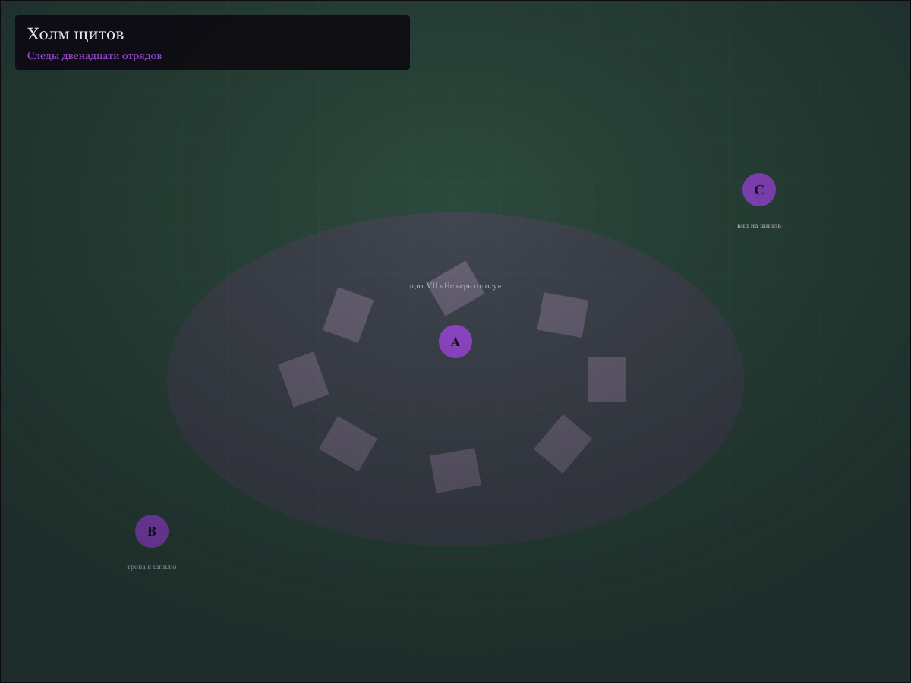

**Место:** придорожный **холм** из **ржавых** щитов и **обломков** знамён. Ветер **стучит** металлом.

**Разум / Внимание ≥ 11:** на щите **VII** — царапина: *«Не верь голосу»* — почерк **разный** у **трёх** щитов.

**Природа ≥ 10:** следы **не** уходят **от** шпиля — **круги** вокруг (герои **ходят** кругами **годами**).

**Опционально:** стая **волков** (бестиарий) или **отряд** культистов — **засада**.

**Клиффхэнгер лёгкий:** вдали **Чёрный шпиль** — на вершине **мигает** тусклый **свет**, как **свеча** в окне **детской**.

---

## Сцена 3. Врата шпиля

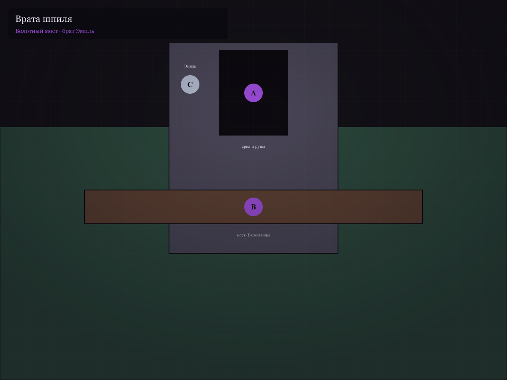

**Место:** арка из **базальта**, гаргульи **обглоданы** кислотой. Мост через **болото** — **гнилые** доски.

**Ловкость / Выживание** серия против **10** — иначе **1 стресс**, **+1 Зов** (провал в **трясину** — шум).

**Гаргульи** — не живые, но **руны** на арке:

**Руны** *(если читают)*: «Войди, кто верит; правда — тяжелее камня.»

**Культист у ворот** — **брат Эмиль**, худой, глаза **горят**.

**Эмиль:** «Вы **опоздали** на **вечернюю** молитву. Принцесса **спит** — **не** кричите. **Снимите** оружие. **Сердце** должно быть **лёгким**.»

**Социальный удар** или **Запугивание ≥ 12** — Эмиль **отступает**, шепчет: «Если **увидите** **зеркала** — **не** смотрите **долго**. Она **внутри** них **иногда**.»

**Отказ снять оружие** → бой: **2 культиста** + Эмиль (бестиарий); **шум** → **+1 Зов**.

---

## Сцена 4. Часовня первого яруса

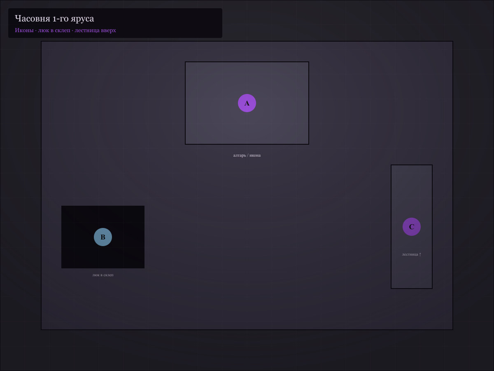

**Место:** **иконы** «спящей девы», свечи **чёрного** воска. За алтарём — **люк** вниз (склеп) и **лестница** вверх.

**Религия / Проницательность ≥ 11:** икона **моложе** легенды — лик **нарисован** **поверх** старого (под ним **другая** девочка).

**Склеп** *(опционально)*: саркофаг **короля Осрика** — тело **есть**, печать **свежая** (*«Терон»* на воске). → **трещина** (король **мёртв**, регент **врёт**).

В **нише** у саркофага — **шкатулка** с письмом на **почерке Милдред** (*Скрытность / Внимание ≥ 12*):

> *«Терон. Ещё **один** отряд до **зимы**. Я **не слышу** её во сне. Если эхо **умрёт** — я **забуду** лицо. **Сделай** что должен. — М.»*

→ **трещина** «Письмо матери». Альтернатива: то же письмо в **сундуке** за портретом в сцене 5.

**Благословение Эмиля** «для успеха» — если принять не думая → **+1 Сказка**.

**Голос принцессы** (модуль §4): *«Вы **хорошие**… я **ждала**…»*

---

## Сцена 5. Галерея портретов (2-й ярус)

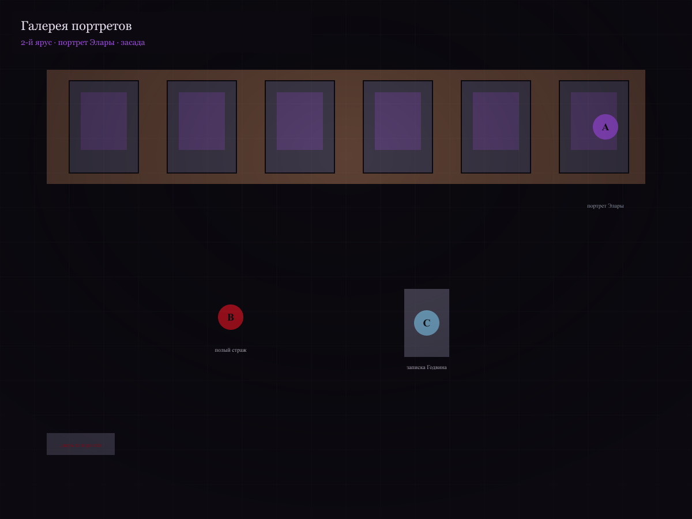

**Место:** ряд **портретов** королевской семьи. Один **пустой** гвоздь. В конце — **Элара** в **серебряном** платье.

**История / Внимание ≥ 12:** фасон платья — **позже** смерти Элары; подпись **подделана** (*Трещина* «Портрет»).

**За портретом** — **ниша** с **запиской Годвина**: *«Зеркало **пьёт** клятву. Не **спасайте** — **разбейте**»*.

Если **Сказка ≥ 4**, портрет **шепчет** *(иллюзия)*: «**Отец**… регент… он **держит** меня…» — искушение **бежать наверх** (модуль §4).

**Засада:** **полый страж** (см. бестиарий) — бывший **рыцарь III** отряда. Движения **рваные**.

**Полый страж:** «**Клянусь**… **спасти**… **Элару**…»

После боя — **дверь за спиной** **запирается** (**+1 Зов** если уже **≥ 2**). Впереди — **стук** когтей. **Клиффхэнгер сессии 1.**

**Терон** *(голос с потолка, магический)*: «Не **бойтесь**. Вы **близко**. **Она** **зовёт**.»

---

# Сессия 2. «Комната без принцессы»

## Сцена 6. Оружейная и лестница на мост

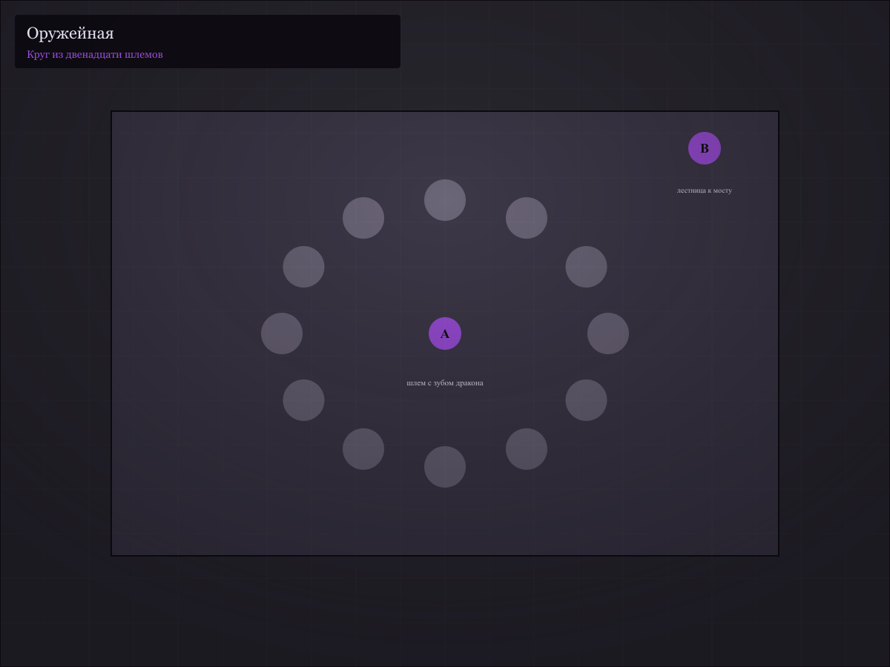

**Место:** сломанные **катапульты**, **костры** давно **холодные**. На полу — **двенадцать** **пустых** шлемов, выстроенных **кругом**.

**Внимание ≥ 11:** в одном шлеме — **зуб** дракона и **записка**: *«Пепельница **устала**. Спроси: **что** она **ела**»*.

Подготовка к мосту: **огнестойкие** зелья / **укрытие** — по снаряжению.

---

## Сцена 7. Мост Пепельницы

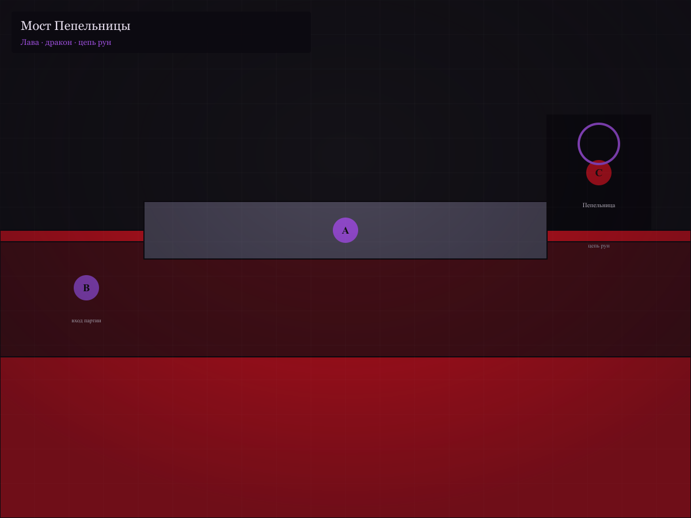

**Место:** узкий **каменный** мост над **лавой** *(или кислотным озером)*. В конце — **Пепельница**, **чёрный** дракон, **шрамы** на шее — **цепь** с рунами.

**Пепельница** *(не атакует сразу)*: «Ещё **одни**. Терон **обещал**, что вы **последние**. **Говорите** быстро.»

**Варианты:**

| Подход | Проверка | Исход |
|--------|----------|-------|
| **Сила** | Запугивание ≥ 13 | дракон **смеётся**, **+1 Зов**; бой |
| **Правда** | 3+ трещины, честный вопрос | разговор |
| **Сделка** | Дипломатия ≥ 12 | «Принесите **сердце** зеркала — **отпущу**» |
| **Обход** | Скрытность серия **11+** | мост **без** разговора — **Пепельница** **догонит** в сцене 9 |

**Пепельница** *(если говорит)*: «**Она** **умерла**, когда **ваши** отцы **ещё** **сосали** **палец**. Я **охраняю** **кости** и **золото**. **Голос** — **ваш**. **Вы** **кормите** **зеркало**, когда **верите**.»

→ **трещина** «Пепельница говорит».

**Бой:** используйте **Красного дракона (молодого)** или **Чёрного дракона** из фэнтези-бестиария — для этой сцены **снимите 5 ран** (усталость) или дайте **цепь**: при **разрушении рун** `2d6+Сила ≥ 13` — **Воля** дракона **−2** на сцену, он **отступает**.

**Пепельница** *(ранена)*: «**Разбейте** **зеркало**. Или **станьте** **четырнадцатым**.»

---

## Сцена 8. Коридор зеркал

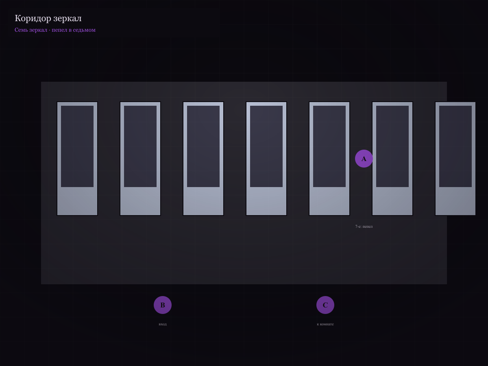

**Место:** **семь** зеркал. В **шести** — **вы**, но **моложе/смелее** — «версии, **которые спасли** её».

**Воля** каждый проход: `2d6 + Воля` ≥ **10 + Сказка** или **+1 стресс** («видел **себя** с **ней** на руках»).

**Седьмое** зеркало **пустое** — только **пепел** на полу **детского** размера.

**Сказка ≥ 3:** иллюзия **Элары** в зеркале — **протягивает руку**. Касание → **+1 Зов**, состояние **Очарован** (1 раунд) или **+1 Сказка**.

---

## Сцена 9. Комната «принцессы»

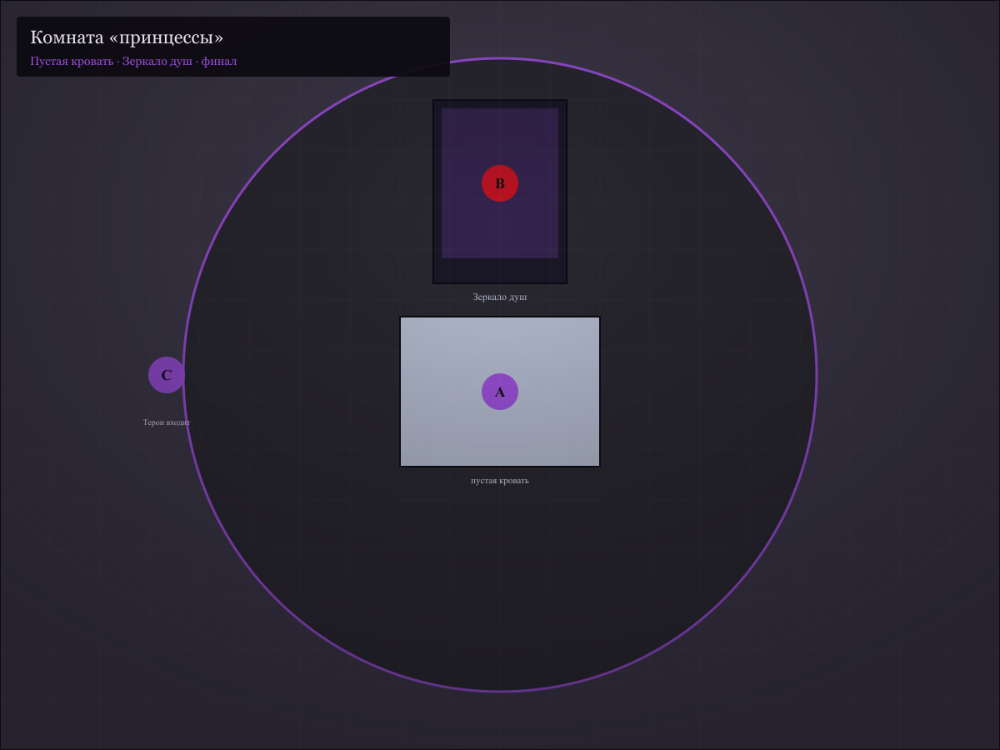

**Место:** **круглая** комната, **розовые** обои **выцвели**. **Кровать** с **золотой** балдахином — **пустая**. На подушке — **серебряный** венок и **кукла** без **лица**.

**Зеркало душ** — **трёхметровое**, серебро **потемнело**. В глубине — **туман**, **не** лицо.

**Голос Элары** *(из зеркала)*: «Вы **пришли**! Я **здесь**! **Только**… **войдите**… **вместе**…»

**Внимание / Магия ≥ 12:** зеркало **тянет** не **принцессу** — **вашу** **Волю**; в отражении **нет** Элары — **есть вы**.

→ **трещина** «Пустая кровать».

**Терон** входит **без** стука. **Не** злодейски — **устало**.

**Терон:** «Вы **дошли**. Как **Годвин**. Он **понял** в **последнюю** секунду. **Не** **разрушайте** — **поддержите**. **Эхо** **исчезнет** — и **я** **забуду** её **лицо**. **Вы** **же** **помните** **лица**? **Не** **дайте** **миру** **забыть** **надежду**.»

Если есть **трещина** «Письмо матери» — Терон **бледнеет**, если её **зачитывают**:

**Терон:** «Она **мать**. Вы **не** судьи. **Судите** **меня** — но **не** её **боль**.»

---

## Сцена 10. Финал

**Цели Терона:** **запустить** жатву (Зов **6**) или **убедить** добровольно **встать** у зеркала.

**Цели партии:** **выжить**, **разбить** зеркало, **убить** Терона, **договориться** с драконом.

**Тест на разочарование** (если 3+ трещины) — перед финальным ходом (модуль §1.3).

**Бой Терона** + **автомат зеркала** (бестиарий). Каждый **раунд** при **Зов ≥ 4**: `2d6 + Воля` ≥ **12** или **1 стресс** («голос **зовёт** **изнутри**»).

### Таблица исходов

| Исход | Что происходит |
|-------|----------------|
| **А. Зеркало разбито** | Эхо **умирает** **навсегда**; Терон **теряет** рассудок или **бросается** в **лаву**; **Пепельница** **отпускает** (если жива); королевство **узнаёт** правду — **хаос**, **не** награда |
| **Б. Терон убит, зеркало цело** | Голос **молчит** **месяц**, потом **возвращается** **слабее**; **новые** герои **пойдут** снова |
| **В. Добровольная жертва ПК** | ПК **становится** **голосом** — **НПС** с **Опустошён**; остальные **уходят**; **хоррор-энд** |
| **Г. Пепельница съела Терона** | По **сделке**; дракон **свободна** **частично**; партия **уходит** с **проклятием** (**+2 стресса**, сны о **детском** пепле) |
| **Д. Партия в зеркале** | **Полые** **рыцари** **через** **год**; **плохой** конец |
| **Е. Бегство без ответа** | Шпиль **рушится** **частично**; правда **не** доказана; **Сказка** **2** — «мы **спасли** **себя**» |
| **Ж. Правда у двора** | Партия **несёт** письмо Милдред / осколок зеркала во **двор** — см. сцену 11 |

**Идеального финала нет.** Принцессу **не** вернуть.

---

## Сцена 11. Эпилог во дворе *(опционально)*

*Если герои **вернулись** с **доказательством** (письмо, осколок, свидетельство Пепельницы) и хотят **обвинить** власть.*


**Милдред** **не** в тронном зале — в **часовне** дворца. **Терон** **между** партией и матерью.

**Милдред:** «Вы **живы**. Значит… *долгое молчание* …значит, **она** **всё ещё** там?»

Если показать **пустую** ленту / пепел / письмо:

**Милдред:** «Я **знала**. *не плачет* Я **знала** с **тридцатого** года. И **всё равно** слушала. **Простите** меня — **нет**. **Простите** **её**. Она **семь лет** была. **Мы** — **старые**.»

| Ход | Исход |
|-----|-------|
| **Публичное обвинение** | Регентство **рушится**; Милдред **затворница**; **новая** охота за «спасителями» **прекращается** — но **горе** **не** исцелено |
| **Шантаж / молчание** | Золото **двойное**; правда **погребена**; **+2 стресса** — «мы **продали** правду» |
| **Милдред отдаёт себя** | Мать **идёт** в шпиль **сжечь** зеркало **сама** — финал **без** героев; **Сказка** **0** |

**Эпилог — Гав** *(если жив)*: «Тринадцатый жетон… *вешает* …**пустой**. Значит, **лучше**, чем **двенадцатый**.»

**Карты:** [галерея](maps/chernyy-shpil/MAPS.md) · `npm run build:chernyy-shpil-maps`

---

# Бестиарий приключения

*ЧЦ защиты = 8 + Ловкость + доспех. Урон = (итог атаки − ЧЦ) + бонус.*

## Культист «Спящей Розы»

- **Угроза:** низкая  
- **Тело 2, Ловкость 2, Разум 2, Воля 4**  
- **Раны 6** · ряса **+1** к ЧЦ  
- **Посох +1**  
- **Реплика:** «Она **видит** сны **о вас**. **Не** **будите** **грехом**.»

## Брат Эмиль

- **Угроза:** средняя  
- **Тело 2, Ловкость 2, Разум 3, Воля 5**  
- **Раны 8**  
- **Благословение** — раз за сцену **+1 стресс** цели, если **Сказка ≥ 3** и провал **Воли ≥ 11**  
- **Реплика:** «**Сердце** **лёгкое** — **дверь** **открыта**.»

## Громила таверны

- **Угроза:** низкая  
- **Тело 3, Ловкость 2, Разум 1, Воля 1**  
- **Раны 6** · кожанка **+1**  
- **Дубина +1**

## Полый страж (бывший рыцарь)

- **Угроза:** средняя  
- **Тело 4, Ловкость 1, Разум 0, Воля 1**  
- **Раны 10** · латы **+2** к ЧЦ  
- **Меч +2**  
- **Особое:** **иммун** к **страху**; при смерти **шёпот** *«прости… Элара…»* — **+1 Сказка** у **верующих** (жестокий твист)

## Полый рыцарь Годвин (мини-босс)

- **Угроза:** высокая  
- **Тело 4, Ловкость 2, Разум 1, Воля 2**  
- **Раны 14** · латы **+2**  
- **Меч +3**  
- **Особое:** **узнаёт** **медальон** Гава — на **1 раунд** **замирает** (если показали)  
- **Реплика:** «Я **дошёл**… **я** **видел**… **пусто**…»

## Регент Терон

- **Угроза:** высокая  
- **Тело 2, Ловкость 2, Разум 5, Воля 5**  
- **Раны 9**  
- **Дальняя магия «Связь» +3**, **кинжал +1**  
- **Особое:** раз за сцену **призыв** — **+1 Зов**; при **Зов ≥ 5** — **вливает** в зеркало (**2 стресса** цели в **Рядом** от отражения)  
- **Цель:** **добровольная** жертва или **задержать** до жатвы  
- **Реплики:** см. сцены 9–10

## Автомат зеркала

- **Угроза:** средняя (объект)  
- **Раны 12** (броня **+3** к ЧЦ)  
- **Особое:** каждый **раунд** активен — одна цель: `2d6+3` **против Воли** или **Опустошён** (следующая **магия/клятва** кормит зеркало **+1 Зов**)  
- **Слабость:** **серебро**, удар **звоном** (колокол эха) **+2** урон

## Пепельница

- См. **Чёрный дракон** или **Красный дракон (молодой)** в [фэнтези-бестиарии](../modules/fantasy-bestiariy.md) — для сцены 7 **−5 ран**, цепь на шее (**Сила ≥ 13** снимает **−2 Воля**).

---

# Шпаргалка ведущего

| NPC | Роль | Уступчивость |
|-----|------|--------------|
| Терон | регент, хранитель лжи | **Закрыт** → ломается при **трещинах** |
| Милдред | мать, **соучастница** | **Закрыта** → ломается при **письме**; не злодей — **жертва времени** |
| Пепельница | страж, не союзник | **Сделка** при правде |
| Гав | память прошлых отрядов | открыт за **вино** |
| Эмиль | вера / страх | **Ключевое** при религии |
| Годвин | предупреждение | только **медальон** |

**Без модуля:** Сказка = насколько стол **верит**; Зов = насколько **шумят**; трещины = улики **автоматом** с ценой.

**Одна сессия:** сцена 0 **коротко**, сцена 3–9, финал **без** болота.

---

## Подсказки по системе

- Проверки — **2d6 + атрибут + ранг**; ЧЦ как ориентир.
- Социальные сцены — один бросок; при модуле `hero_trap` — **социальный удар**, **Тест на разочарование**, **голос принцессы**.
- Бой — **Рукопашная / Рядом / Даль**; дракон — см. [фэнтези-бестиарий](../modules/fantasy-bestiariy.md).
- **Стресс:** зеркала, клятвы, полые рыцари — **1 стресс** по усмотрению.

# Часть IX. 14 иллюстраций (список для вёрстки/генерации)

*Battlemap уже есть (см. `maps/chernyy-shpil/`); ниже — художественные вставки и обложка.*

1. **Обложка:** чёрный шпиль в тумане, серебряная лента на переднем плане, фиолетовое свечение окна. Макет: [`maps/chernyy-shpil/cover.png`](maps/chernyy-shpil/cover.png).
2. Шатры брифинга: потёртый герб, воск и дождь.
3. Доска тринадцати жетонов в таверне «У Безымянного».
4. Холм щитов: надпись «Не верь голосу» на ржавом щите.
5. Врата шпиля: гаргульи, болотный мост.
6. Часовня: икона «спящей девы», чёрные свечи.
7. Портрет Элары — платье не той эпохи (крупно).
8. Полый страж в галерее.
9. Мост Пепельницы: дракон на цепи, лава внизу.
10. Коридор зеркал: семь отражений-«спасителей».
11. Пустая кровать и Зеркало душ.
12. Регент Терон у зеркала (портрет).
13. Королева Милдред в часовне дворца (эпилог).
14. Жетон XIII на гвозде — пустой (Гав).

# Часть X. Обложка и препресс

| Параметр | Значение |
|----------|----------|
| **Формат блока** | A4 (210×297 мм) или digest 148×210 мм |
| **Поля** | 18/16/20/16 мм (как в `npm run pdf:hranitel`) |
| **Вылеты** | +3 мм с каждой стороны обложки |
| **Корешок** | ~4 мм на ~22 страницы текста + вставки карт |
| **Шрифты** | Cormorant Garamond (заголовки), Source Sans 3 (текст) |
| **Обложка** | Матовая ламинация; акцент — фиолетовый `#9d4edd` на тёмном `#141218` |
| **Карты** | PNG 1200×900; печать на отдельных листах или в приложении |
| **Препресс** | PDF/X-1a; обложка ≥300 dpi; внутренний блок можно из `npm run pdf:hranitel` |

Перегенерация макета обложки: `npm run build:adventure-covers`.
