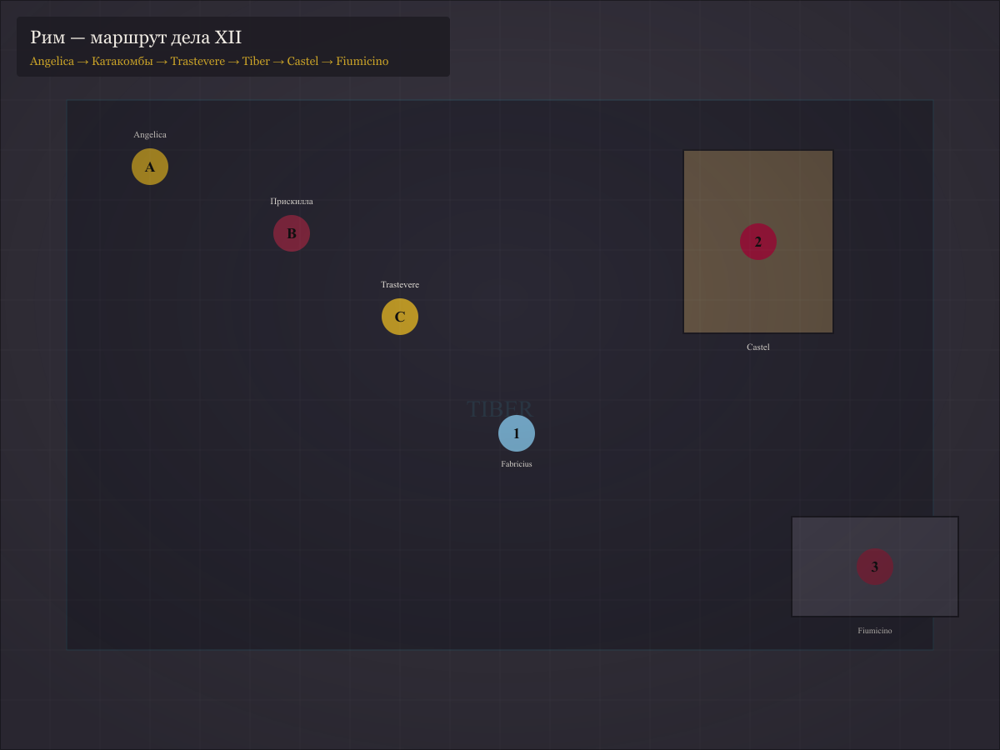
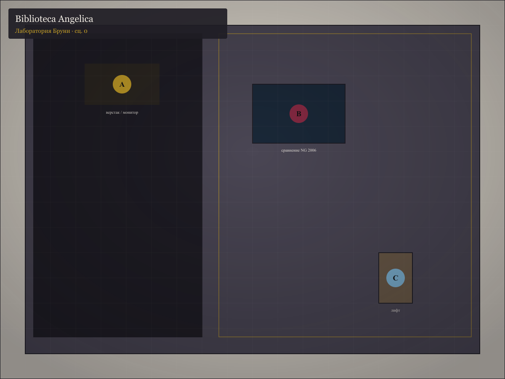
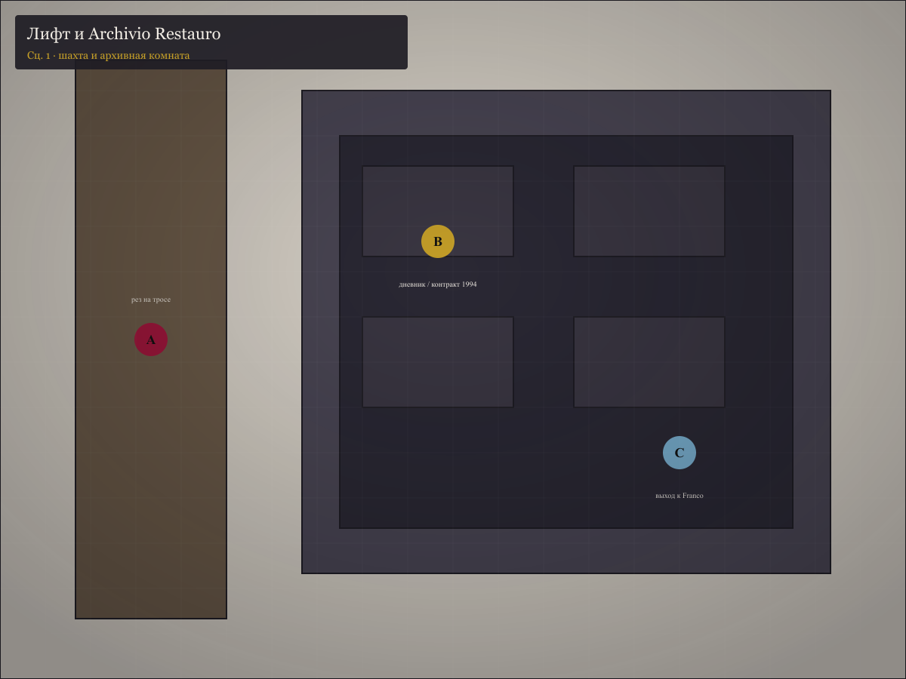
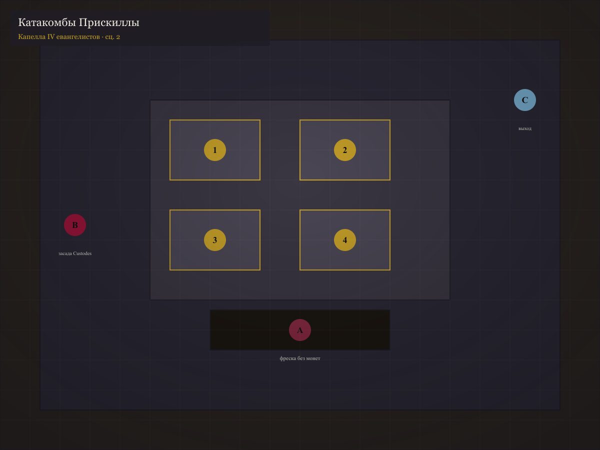
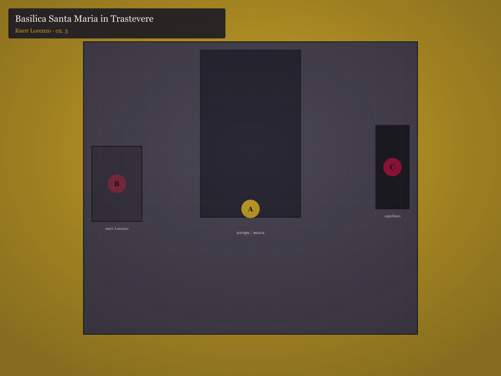
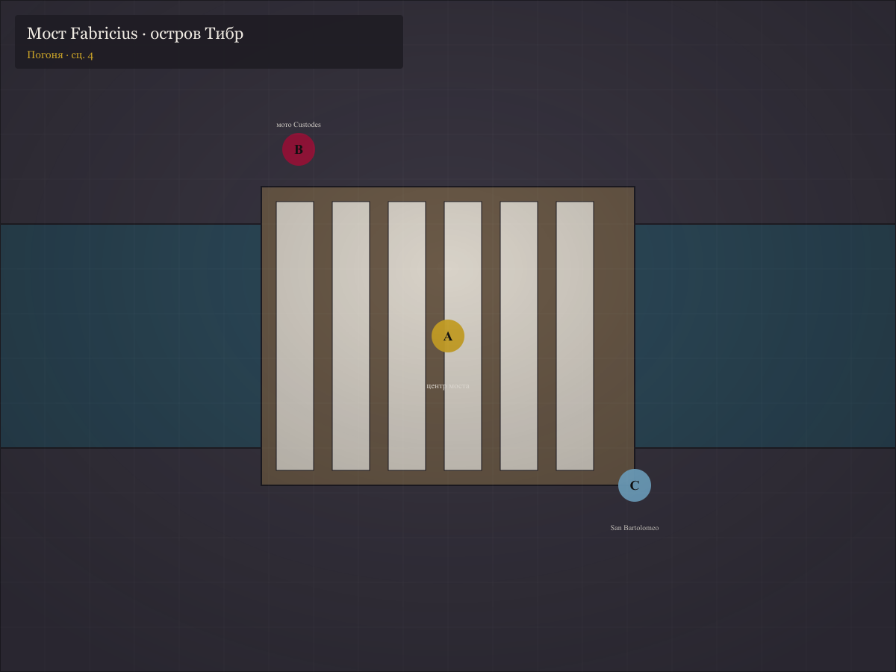
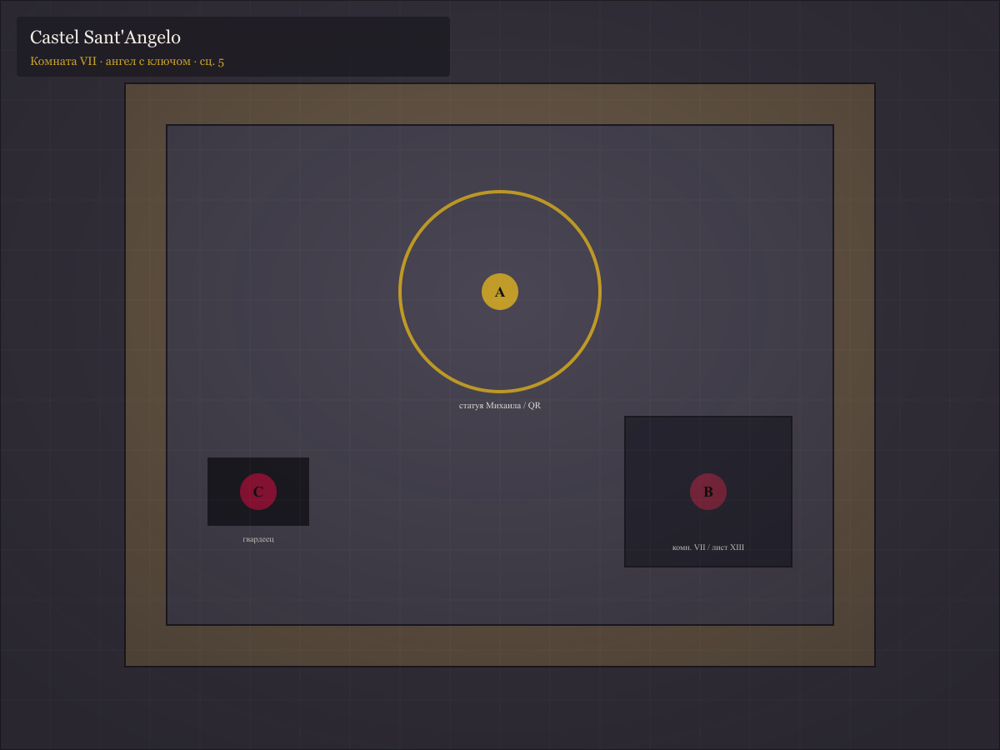
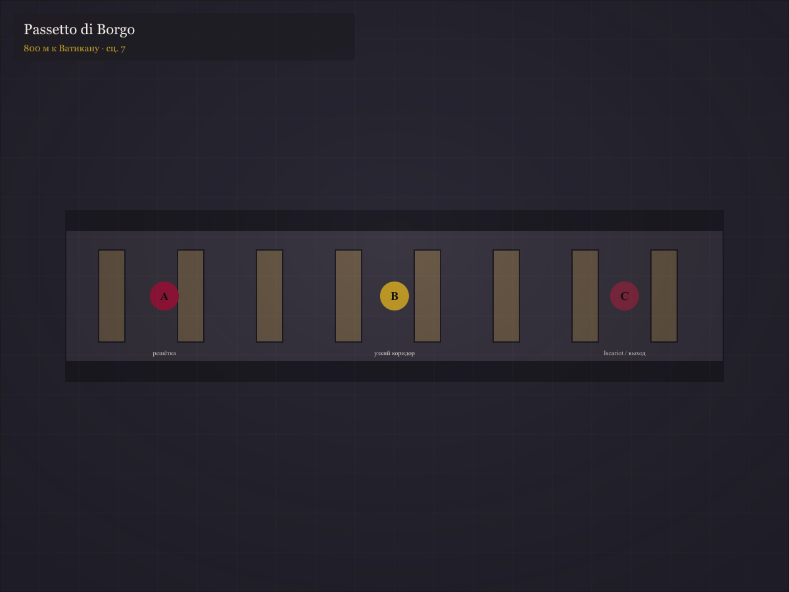
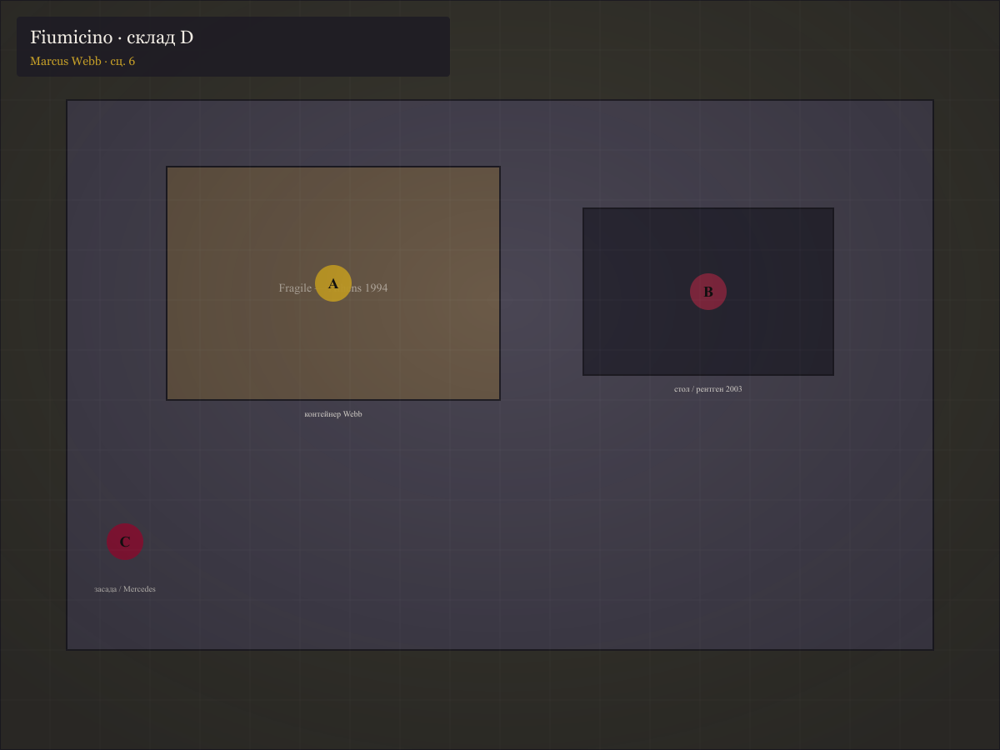
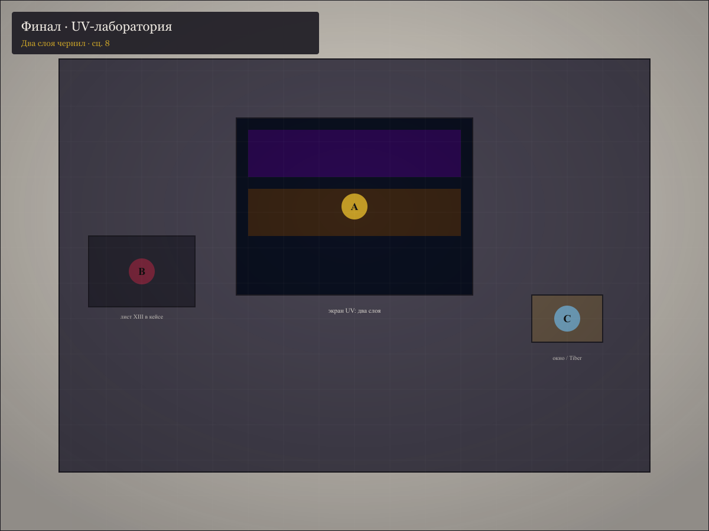

# Карты «Дело № XII: Поцелуй Иуды»

**10 battlemap** + **обзор Рима** для [«Поцелуй Иуды»](../../05-apokrif-iudy.html). Стиль: мокрый булыжник, золото базилик, тёмный Тибр, фиолет UV в финале.

Маркеры **A / B / C** — ключевые точки сцены (улики, NPC, укрытия). Нажмите на изображение, чтобы открыть в полном размере.

<figure class="map-card">

<figcaption><strong>00.</strong> Рим — обзор маршрута (Angelica → Fiumicino)</figcaption>
</figure>

<figure class="map-card">

<figcaption><strong>01.</strong> Angelica — лаборатория Бруни (сц. 0)</figcaption>
</figure>

<figure class="map-card">

<figcaption><strong>02.</strong> Лифт и Archivio Restauro (сц. 1)</figcaption>
</figure>

<figure class="map-card">

<figcaption><strong>03.</strong> Катакомбы — IV евангелиста (сц. 2)</figcaption>
</figure>

<figure class="map-card">

<figcaption><strong>04.</strong> Basilica Santa Maria in Trastevere (сц. 3)</figcaption>
</figure>

<figure class="map-card">

<figcaption><strong>05.</strong> Мост Fabricius — погоня (сц. 4)</figcaption>
</figure>

<figure class="map-card">

<figcaption><strong>06.</strong> Castel Sant'Angelo — ангел, комн. VII (сц. 5)</figcaption>
</figure>

<figure class="map-card">

<figcaption><strong>07.</strong> Passetto — бегство 800 м (сц. 7)</figcaption>
</figure>

<figure class="map-card">

<figcaption><strong>08.</strong> Fiumicino — склад Webb (сц. 6)</figcaption>
</figure>

<figure class="map-card">

<figcaption><strong>09.</strong> UV-лаборатория — финал, два слоя (сц. 8)</figcaption>
</figure>

Перегенерация: `npm run build:apokrif-iudy-maps`
