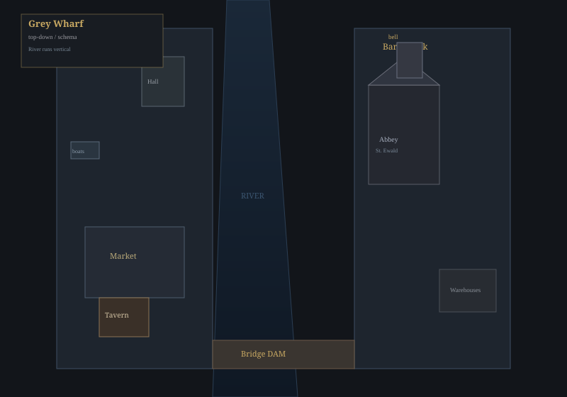
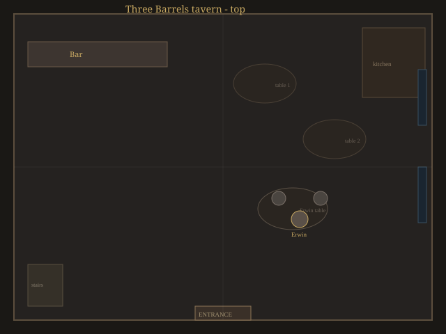
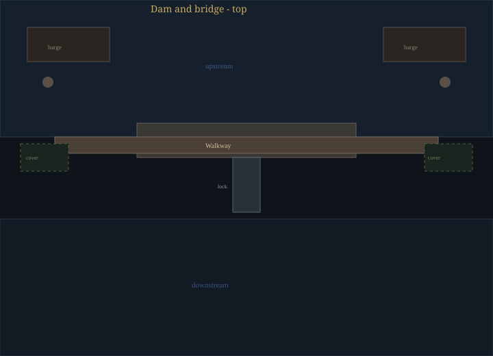
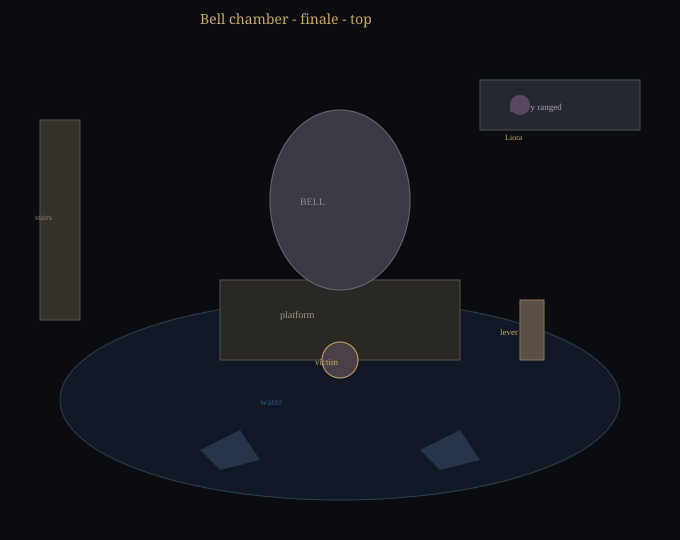
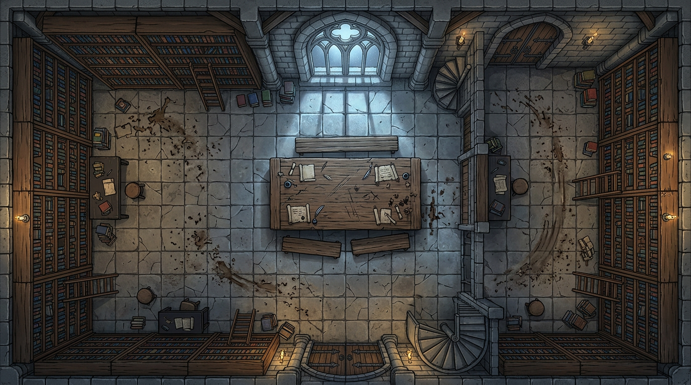
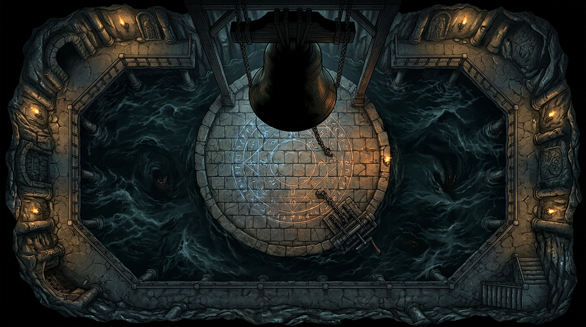

# Карты «Стеклянный звон»

**6 battlemap** для [стартового приключения](../../01-steklyannyy-zvon.html). Общая карта города и таверна совпадают со стилем [«Чёрного счёта»](../chernyy-schet/MAPS.md).

<figure class="map-card">

<figcaption><strong>01.</strong> Серый причал — обзор</figcaption>
</figure>

<figure class="map-card">

<figcaption><strong>02.</strong> Таверна «У трёх бочек»</figcaption>
</figure>

<figure class="map-card">

<figcaption><strong>03.</strong> Запруда и мост</figcaption>
</figure>

<figure class="map-card">

<figcaption><strong>04.</strong> Камера под колоколом</figcaption>
</figure>

<figure class="map-card">

<figcaption><strong>05.</strong> Библиотека обители</figcaption>
</figure>

<figure class="map-card">

<figcaption><strong>06.</strong> Камера под колоколом — баттлмап</figcaption>
</figure>

