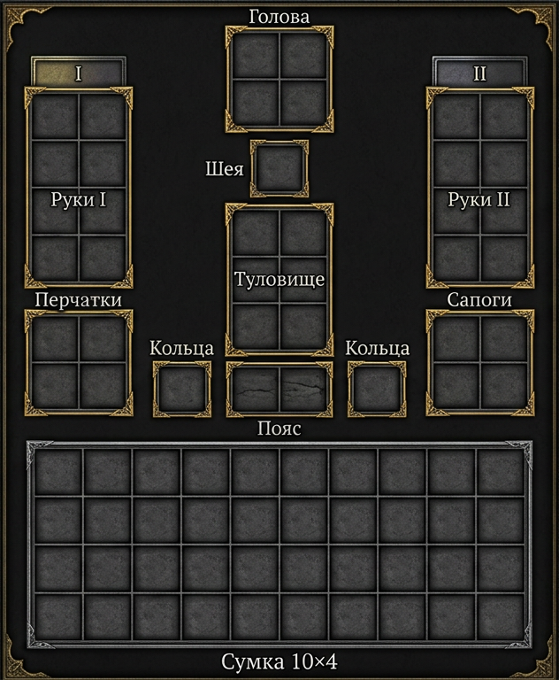

# Фэнтези-модуль: инвентарь

*Дополняет [03-snaryazhenie.md](03-snaryazhenie.md) и [05-snaryazhenie.md](../05-snaryazhenie.md). Даёт детальные ограничения: сетка сумки и слоты экипировки.*

<figure class="inventar-schema-fig">
  
</figure>

## 1. Сумка: сетка 10×4

У персонажа есть **сумка** — сетка **10 столбцов × 4 ряда** (40 клеток). Предметы имеют размер **ширина × высота** в клетках. Располагаются в сумке **без наложения**. Размер предмета указывается в описании; по умолчанию — см. таблицу ниже.

| Категория | Размер (Ш×В) | Примеры |
|-----------|--------------|---------|
| Зелье, малый предмет | 1×1 | зелье лечения, антидот, крюк, нож метательный |
| Кинжал, фонарь, верёвка | 1×2 | кинжал, факел, свёрток верёвки |
| Меч, топор, булава | 2×1 | короткий меч, топор боевой |
| Длинный меч, посох, копьё | 2×2 или 3×1 | длинный меч, копьё, посох |
| Лук, арбалет | 3×2 | лук лёгкий, лук тяжёлый, арбалет |
| Щит малый | 2×2 | щит малый |
| Щит большой | 3×3 | щит большой |
| Доспех (нагрудник) | 3×2 | кираса, латы |
| Крупный груз | по решению | свёрток, ящик |

**Правила размещения:**
- Предмет кладётся в сумку **целиком** — занимает прямоугольную область своего размера.
- Поворачивать предмет можно (3×2 и 2×3 — один и тот же размер).
- Свободное место должно совпадать по форме; ведущий может потребовать схему или считать на глаз.

## 2. Слоты экипировки

На персонаже **не в сумке** размещаются следующие слоты (всегда по одному предмету на слот):

| Слот | Описание |
|------|----------|
| **Голова** | шлем, шапка, капюшон, маска |
| **Шея** | медальон, амулет, ожерелье |
| **Туловище** | кираса, кольчуга, латы, стёганка, кожа |
| **Пояс** | поясной мешочек, ножны (лёгкое оружие), подвеска |
| **Руки (2)** | оружие, щит — левая и правая. Щит большой — обе руки |
| **Кольца (2)** | кольцо левой руки, кольцо правой руки |
| **Перчатки** | перчатки, краги |
| **Ноги** | сапоги, поножи |

**Особенности:**
- В слоты «Руки» можно экипировать **два оружия** (меч + щит, два кинжала и т.д.) или **одно двуручное** (длинный меч, лук в бою).
- **Щит большой** занимает обе руки.
- Предметы в слотах **не занимают место в сумке**.

## 3. Второй комплект оружия за спиной

Если у персонажа **два набора оружия** (например, меч+щит и лук+стрелы), второй комплект можно **убрать за спину**:
- Не считается в сумке.
- Смена комплекта — **1 ОД** (или действие по договорённости).
- Только **один** второй комплект; третий и далее — в сумку.

*Пример:* воин носит **меч + щит** в руках, **лук + колчан** за спиной. Лук и стрелы не занимают клетки сумки.

## 4. Таблица размеров (сводная)

| Предмет | Размер |
|---------|--------|
| Зелье, малый расходник | 1×1 |
| Кинжал, факел, крюк | 1×2 |
| Короткий меч, топор, булава | 2×1 |
| Длинный меч, копьё, посох | 2×2 или 3×1 |
| Лук, арбалет | 3×2 |
| Щит малый | 2×2 |
| Щит большой | 3×3 |
| Доспех (грудная часть) | 3×2 |

Ведущий может задать свой размер для нестандартных предметов.

## 5. Перегруз

Если суммарный «объём» или количество слотов превышает разумное (слишком много мелких предметов, не влезает в сумку), ведущий может наложить **−1** к проверкам **Тела** и **Ловкости** до разгрузки.

---

## Пример из партии: «Стеклянные волки»

**Гарр** экипирован: **шлем** (голова), **медальон Лин** (шея), **кольчуга** (туловище), **меч** (правая рука), **щит малый** (левая рука), **кольцо** (правая рука). В сумке: зелье 1×1, верёвка 1×2, крюки 1×1 — остаётся запас. Второй комплект **лук + колчан** за спиной — при переключении на дальний бой тратит 1 ОД.

**Кай** несёт **посох** (руки), в сумке — кристалл для посоха 1×1, антидот 1×1, несколько зелий. Слот «шея» свободен под будущий амулет.
